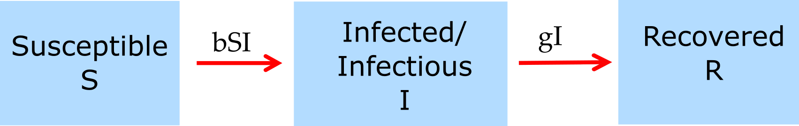

```{r, echo = FALSE}
#this code loads the settings file for the current app so we can automatically 
#list the functions in the further information section
currentrmdfile = knitr::current_input() 
currentappinfo = gsub("_documentation.Rmd" ,"_settings.R",currentrmdfile)
source(currentappinfo)
```


## Overview {#shinytab1}
This app implements the basic SIR (susceptible-infected-recovered) model and allows you to explore a very basic infectious disease simulation. The main goal is to provide familiarity with the overall setup and ideas behind using these simulations, and how to run them. Read about the model in the "Model" tab. Make sure to read the 'general notes' section. Then do the tasks described in the "What to do" tab. Finally, check out the "Further Information" tab to learn where you can find some background information on this (and many of the other) apps.


## The Model {#shinytab2}

### Model Overview
This model is a compartmental SIR (susceptible-infected-recovered) model. Compartmental means that we place individuals into distinct compartments, according to some characteristics. We then only track the total number of individuals in each of these compartments. In the simplest model, the only characteristic we track is a person's infection status. We allow for 3 different stages/compartments: 

* **S** - uninfected and susceptible individuals. 
* **I** - infected and infectious individuals (note that these terms are often used interchangeably, but technically we are talking about someone who is infected **and** is infectious, i.e. can infect others).
* **R** - recovered/removed individuals. Those are individuals that do not further participate, either because they are now immune or because they died.

The SIR model is very basic. It could be extended by introducing further compartments. For instance, we could stratify according to gender, which would give us 2 sets of SIR compartments, one for males and one for females. Some of these extensions are implemented in other apps.

In addition to specifying the **compartments** of a model, we need to specify the **processes/mechanisms** determining the changes for each compartment. Broadly speaking, there are processes that increase the number of individuals in a given compartment/stage, and processes that lead to a reduction. Those processes are sometimes called inflows and outflows. 

For our system, we specify only 2 processes/flows: 

* A susceptible individual (S) can become infected by an infectious individual (I) at some rate (for which we use the parameter _b_). This leads to the susceptible individual leaving the S compartment and entering the I compartment.   
* An infected individual dies or recovers and enters the recovered/removed (R) compartment at some. This is described by the parameter _g_ in our model.

As with the compartments, we could extend the model and allow other processes to occur. For instance, we could allow for natural births and deaths, waning immunity, deaths due to disease, etc. Some of that will be included in other apps. 

### Model Representation
For compartmental models (and also often other types of models), it is useful to show a graphical schematic representation of the compartments and processes included in the model. For compartmental models, such a diagram/figure is usually called a flow diagram. Such a diagram consists of a box for each compartment, and arrows pointing in and out of boxes to describe flows and interactions. For the simple SIR model, the flow diagram looks as follows:


```{r diagram, fig.cap='Flow diagram for simple SIR model.',  echo=FALSE}

```


### Model Implementation I
To allow us to simulate this model, we need to implement it on the computer. For that purpose, it is often useful to write the model as mathematical equations (this is not strictly needed, some computer simulation models are never formulated as mathematical models). A very common way (but not the only one) to implement compartmental models such as the simple SIR model is a set of ordinary differential equations. Each compartment/variable gets an equation. The right side of each equation specifies the processes going on in the system and how they change the numbers in each compartment via inflows and outflows. For the model described above, the equations look like this: 

$$
\begin{aligned}
\dot S & = -bSI \\
\dot I & = bSI - gI \\
\dot R & = gI
\end{aligned}
$$

*Note: If you don't see equations but instead gibberish, try opening the app with a different browser. I have found that occasionally, on some computers/browsers, the math is not shown properly.* 


### Model Implementation II
Continuous time models implemented as ordinary differential equations are the most common types of models. However, other implementations of the above model are possible. One alternative formulation is a **discrete-time deterministic** equivalent to the ODE model. For such an implementation, the equations are:

$$
\begin{aligned}
S_{t+dt} & =  S_t + dt * \left( - b I_t S_t \right) \\
I_{t+dt} & =  I_t + dt * \left( b I_t S_t - g I_t \right) \\
R_{t+dt} & =  R_t + dt * \left( g I_t  \right)
\end{aligned}
$$ 

In words, the number of susceptible/infected/recovered at a time step _dt_ in the future is given by the number at the current time, t, plus/minus the various inflow and outflow processes. The latter need to be multiplied by the time step, since less of these events can happen if the time step is smaller. As the time-step gets small, this discrete-time model approximates the continuous-time model above. In fact, when we implement a continuous-time model on a computer, the underlying simulator runs a "smart" version of a discrete-time model and makes sure the steps taken are so small that the numerical simulation is a good approximation of the continuous-time model. If you want to learn more about that, you can check out the 'deSolve' R package documentation, which we use to run our simulations. 


### Some general notes
* Throughout DSAIDE, I will use _ID_ to abbreviate _infectious disease_
* You will see both the term *host(s)* and *individual(s)* used interchangeably. While we most often think of human hosts, the hosts can be any animal (or plants or bacteria infected by phages or...).
* In general, the entities that change in our model (here the number of individuals in compartments S, I and R) are called variables: They are variable and change during the simulation. 
* In contrast, the quantities that are usually fixed for a given scenario/simulation are called parameters. For this model, those are the infection rate _b_ and the recovery rate _g_.
* Sometimes, parameters can vary during the simulation, but most often they do not.
* If you want to study a specific ID, you choose parameters such that they match the specific disease you want to study. For now, just play around with the model without trying to relate it to some specific ID.
* There are no fixed rules concerning the naming of variables and parameters. Compartments (e.g. SIR) tend to be labeled very similarly by different researchers, while parameter labels are much more variable. Always check carefully for a given paper/model what the meaning of each parameter is.
* Some people prefer diagrams, others equations. In my opinion, it is best to show both. 


## What to do {#shinytab3}

### A few general notes

* Some of the tasks below (and in future apps) are fairly open-ended. The idea is that these tasks give you something to get started, but you should feel free to explore the simulations any way you want. Play with them, query them, go through iterations of thinking what you expect, observing it, and if discrepancies occur, figure out why. Essentially, the best way to use these apps is to _do your own science/research_ with them.

* This and most other simulations/apps in DSAIDE do not have natural time units (unless specifically stated). You could, therefore, assume that your model runs in units of days or weeks/months/years, based on what's most suitable for the disease you want to study. You have to make sure that all your parameters are in the right time units. Always make sure to check if a given simulation can handle different time units or assumes specific ones.

* The app lets you choose the maximum simluation time. Some apps also let you set the starting time and time step. Starting time generally does not matter and is almost always set to 0. Sometimes an app doesn't even allow you to change this. For models like that are based on differential equations, the time step does not affect the internal time steps taken by the numeric solver, only the times for which results are returned. Thus, for some apps, it is also not an input. It is here, so it can run together with a discrete-time model. Only for discrete-time models is this the actual time step that's being taken.

**The tasks below are described in a way that assumes everything is in units of days (rate parameters, therefore, have units of inverse days). If any quantity is not given in those units, you need to convert it first (e.g. if it says a week, you need to convert it to 7 days).**


### Task 1 
* Run the simulation with 1000 susceptible individuals and 1 initially infected host, no recovered. Set simulation duration to 100 days, start time and time step can remain at 0 and 0.1. Set recovery rate _g_=0.5 per day, and infectiousness _b_=0.001. You will get an outbreak of some - currently unspecified - infectious disease. If you did it correctly, your outbreak should end with around 203 uninfected individuals still remaining.


### Task 2 
* Switch the plotting to have x-axis, y-axis or both plotted on a log scale. 
* Leave all other settings as before.
* Note that while the look of the plot changes a lot, nothing has changed about the underlying simulation. The results are exactly the same in each case, only plotted differently. This is something to be aware of when you see plots in papers or produce your own. The best plot to use is the one that shows results of interest in the clearest form. Usually, the x-axis is linear and the y-axis is either linear or logarithmic.
* Try again switching between ggplot and plotly as plotting engine.

### Task 3 
* From the graph, get a (rough) estimate of the day at which the outbreak peaks. That's easiest done when you make a plotly plot.
* Contemplate the fact that the outbreak ends even though there are still susceptible remaining, i.e. not everyone got infected. Do you find that surprising? How could you maybe explain that? This topic is discussed in more detail in the reproductive number app. 
* You have no infected left at the end of the outbreak. Figure out how you can use the information from either the susceptibles or recovered left at the end of the outbreak to figure out how many people in total got infected during the outbreak.
* Rerun the simulation, with the same values you just had. Does anything change? Why (not)?

### Task 4 
* Set "Models to run" to "both"", which runs and shows both the continuous-time and discrete-time models.
* Start with a discrete-time step of 0.01.
* Leave all other settings as before.

Run the simulation, see what you get. You should see the results from the 2 models essentially on top of each other and barely distinguishable.

### Task 5 
* Now try different values for _dt_. 
* Leave all other settings as before.

You should notice that as _dt_ gets larger, the differences between discrete-time and continuous-time models increase. At some point when the time-step gets too large, the discrete-time simulation 'crashes' and you get an error message. This doesn't impact the continuous/ODE simulation since it chooses its time-step during the simulation internally and _dt_ only affects the times for which the results are returned.

### Task 6 
* Go back to running the ODE model only.
* Double the value of the transmission rate, _b_. Leave everything else the same. 
* Compared to what you found in the previous task, how do you expect the min/max and number/fraction of S/I/R at the end of the outbreak to change? What about the time at which the outbreak peaks?
* Run the simulation with the doubled transmission rate, record the same values (final S/I/R and outbreak peak) as above.
* Compare your expectations with the results. How do they agree/disagree? Does it make sense? Anything surprising happening?

### Task 7
* Now, double the rate of recovery, _g_, leave everything as in #2.
* How do you expect the results to change? (Try to make your prediction as precise/quantitative as you can.)
* Run the simulation with these new parameter settings, record the same values as above.
* Compare your expectations with the results. How do they agree/disagree? Does it make sense? Anything surprising happening?

### Task 8 
* Now, double the number of susceptibles, _S~0~_, leave everything else as you just had.
* How do you expect the results to change?
* Run the simulation with these new parameter settings, record the same values as above.
* Compare your expectations with what results. How do they agree/disagree? Does it make sense? Anything surprising happening?

### Task 9 
* Keep playing around with changing any of the parameters and starting conditions.
* Every time, think about what you expect to get, then run the simulation, compare your expectations with the results. Then make sense of it.
* What is the minimum and maximum number of outbreaks you can get? Why is that?


## Further Information {#shinytab4}

* This app (and all others) are structured such that the Shiny part (the graphical interface you see and the server-side function that goes with it) calls an underlying R script (or several) which runs the simulation for the model of interest and returns the results.
* For this app, the underlying functions running the simulation are called ``r appsettings$simfunction[1]`` and ``r appsettings$simfunction[2]``. You can call them directly, without going through the shiny app. Use the `help()` command for more information on how to use the functions directly. If you go that route, you need to use the results returned from this function and produce useful output (such as a plot) yourself. 
* You can also download all simulator functions and modify them for your own purposes.  Of course to modify these functions, you'll need to do some coding.
* For examples on using the simulators directly and how to modify them, read the package vignette by typing `vignette('DSAIDE')` into the R console.

* Some useful books which cover the material of this and most of the other apps (though often at a somewhat more challenging mathematical level) are [@keeling08; @vynnycky10; @bjoernstad18].


### References


