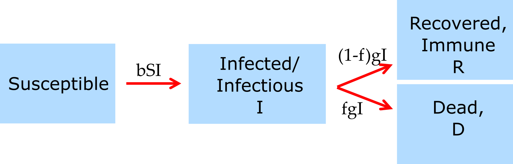

```{r, echo = FALSE}
#this code loads the settings file for the current app so we can automatically 
#list the functions in the further information section
currentrmdfile = knitr::current_input() 
currentappinfo = gsub("_documentation.Rmd" ,"_settings.R",currentrmdfile)
source(currentappinfo)
```


## Overview {#shinytab1}
This app illustrates how to fit a mechanistic dynamical model to data and how to use simulated data to evaluate if it is possible to fit a specific model.


## The Model {#shinytab2}

### Data
For this app, weekly mortality data from the 1918 influenza pandemic in New York City is used. The data comes from [@mills04]. You can read a bit more about the data by looking at its help file with `help('flu1918data')`. 

Alternatively, the model itself can be used to generate artificial data. We can then fit the model to this model-generated artificial data. This is useful for diagnostic purposes, as you will learn by going through the tasks for this app.

### Simulation Model 
The underlying model that is being fit is a version of the basic SIR model. Since the available data is mortality, we need to keep track of dead individuals in the model, too. This can be achieved by including an additional compartment and let a fraction of infected individuals move into the dead instead of the recovered compartment.


```{r diagram, fig.cap='Flow diagram for an SIR model with deaths.',  echo=FALSE}

```


The equations for the model are given by

$$
\begin{aligned}
\dot S & = -bSI \\
\dot I & = bSI - gI \\
\dot R & = (1-f)gI \\
\dot D & = fgI
\end{aligned}
$$

Since the individuals in the _R_ compartment are not tracked in the data and do not further influence the model dynamics, we implement the model without the _R_ compartment, i.e., the simulation runs the equations. 

$$
\begin{aligned}
\dot S & = -bSI \\
\dot I & = bSI - gI \\
\dot D & = fgI
\end{aligned}
$$


### Fitting Model
The data is reported in new deaths per week per 100,000 individuals. Our model tracks _cumulative_, not _new_ deaths. The easiest way to match the two is to sequentially add the weekly deaths in the data to compute cumulative deaths for each week. We can then fit that quantity directly to the model variable _D_. Adjustment for population size is also needed, which is done by dividing the reported death rate by 100,000 and multiplying with the population size. This is further discussed in the tasks. 

The app fits the model by minimizing the sum of square difference (SSR) between model predictions for cumulative deaths and the cumulative number of reported deaths for all data points, i.e.
$$
SSR= \sum_t (D_t - D^{data}_t)^2
$$
where the sum runs over the times at which data was reported. 

It is also possible to set the app to fit the difference between the logarithm of data and model, i.e.
$$
SSR= \sum_t (\log(D_t) - \log(D^{data}_t))^2
$$

The choice to fit the data or the log of the data depends on the biological setting. Sometimes one approach is more suitable than the other. In this case, both approaches might be considered reasonable.

The app reports the final SSR for the fit. 

While minimizing the sum of square difference between data and model prediction is a very common approach, it is not the only one. A more flexible formulation of the problem is to define a likelihood function, which is a mathematical object that compares the difference between model and data and has its maximum for the model settings that most closely describe the data. Under certain assumptions, maximizing the likelihood and minimizing the sum of squares are the same problem. Further details on this are beyond the basic introduction we want to provide here. Interested readers are recommended to look further into this topic, e.g., by reading about (maximum) likelihood on Wikipedia.


### Computer routines for fitting 

A computer routine does the minimization of the sum of squares. Many such routines, generally referred to as _optimizers_, exist. For simple problems, e.g., fitting a linear regression model to data, any of the standard routines work fine. For the kind of minimization problem we face here, which involves a differential equation, it often makes a difference what numerical optimizer routine one uses. `R` has several packages for that purpose. In this app, we make use of the optimizer algorithms called _COBYLA_, _Nelder-Mead_ and _Subplex_ from the the `nloptr` package. This package provides access to a large number of optimizers and is a good choice for many optimization/fitting tasks. For more information , see the help files for the `nloptr` package and especially the [nlopt website](https://nlopt.readthedocs.io/).

For any problem that involves fitting ODE models to data, it is often important to try different numerical routines and different starting points to ensure results are consistent. This will be discussed a bit in the tasks.


## What to do {#shinytab3}

Since the data is in weeks, we also run the model in units of weeks.

### Task 1 
* Find out roughly how many people lived in New York City in 1918. Use that number as your initial starting value for the susceptibles.
* Set infected individuals to 1, no initial dead.
* The model parameters, _b_, _g_, and _f_, are being fit. We still need to provide starting values for the fitting routine.
* Set the starting value for the infection rate to _b=1e-6_.
* Assume the duration of the infectious period is a week, set the initial recovery rate accordingly. 
* Assume that one percent of individuals died.
* For each fitted parameter, choose some lower and upper bounds. Note that if the lower bound is not lower/equal and the upper, not higher/equal than the parameter, you will get an error message when you try to run the model.
* We ignore the parameter values for simulated data, for now, they can be any value. The noise parameter also does not matter for now. Set usesimdata to 0. 
* We'll fit the data 'as is' (not the log-transformed data), so set logfit to 0.
* Start with a 1 fitting step/iteration and solver type 1. Run the simulation. Since you only do a single iteration, nothing is optimized. We are just doing this so you can see the time-series produced with these starting conditions. The 'best fit' parameter values are the same you started with. 
* Also record the SSR so you can compare it with the value after the fit. To that end, we assume that the NYC population was 5E6. With that choice, your SSR should be 7.3E12. Since the data is in weeks, we also run the model in units of weeks.

### Task 2 
* Set the iterations to 50, and re-run the simulation. All of the other settings should be the same from task 1. Look at the results. The plot shows the final fit. The model-predicted virus curve will be closer to the data. Also, the SSR value should have gone down, indicating a better fit. Also printed below the figure are the values of the fitted parameters at the end of the fitting process.
* Set the iterations to 100, and re-run the simulation. You should see some further improvement in SSR. That indicates the previous fit was not the 'best' fit. (The best fit is the one with the lowest possible SSR).


### Task 3 
* Repeat the fits with 1/50/100 iterations using solvers/optimizers "2" and "3" for fitting without changing any of the other settings. You will notice that they do not give the same results. The reason for that is that different solvers are improving fits at different rates. Unfortunately, there is not always a single best optimizer. It depends on the problem/system. Thus it's usually good to try multiple optimizers.
* Depending on the speed of your computer, you can try to increase the number of iterations and see what best fit (smallest SSR) you can achieve.

Generally, with increasing iterations, the fits get better. A fitting step or iteration is essentially an 'attempt' by the underlying code to find the best possible model. Increasing the tries usually improves the fit. In practice, one should not specify a fixed number of iterations. We do it here, so things run reasonably fast. Instead, one should ask the solver to run as long as it takes until it can't find a way to improve the fit (can't further reduce the SSR). The technical expression for this is that the solver has converged to the solution. This can be done with the solver used here (`nloptr` R package), but it would take too long, so we implement a "hard stop" after the specified number of iterations.

### Task 4 
Ideally, with enough iterations, all solvers should reach the best fit with the lowest possible SSR. In practice, that does not always happen. Often it depends on the starting conditions. Let's explore whether starting values matter.

* Set everything as in task 1. Run the simulation for a single iteration, you should get an SSR=7.3E12, and the "best fit" parameter values should equal the starting values, just as in task 1. Now Run the simulation using solver 3 and 200 iterations. If everything was set correctly, you should get SSR=4.3E10. Also, note the best-fit parameter values. 
* Now change the starting values to a 5 percent mortality fraction and half a week of infectiousness duration. Re-run the simulation at 1 and 200 iterations. You should find before/after SSR values of 4.7E12 and 1.8E11. This means the starting values were somewhat better (7.3E12 versus 4.7E12), but it didn't help much for the fitting, at least not for 200 steps (4.3E10 versus 1.8E11). 
* By trying different starting values, solvers, and number of iterations you can get an idea of the influence starting conditions can have on fitting performance and results.

In general, picking good starting values is essential. One can get them by trying an initial visual fit or by doing several short fits, and use the best fit values at the end as starting values for a new fit.
Especially if you want to fit multiple parameters, optimizers can 'get stuck'. If they get stuck, even running them for a long time might not find the best fit. One way an optimizer can get stuck is when a solver finds a local optimum. The local optimum is a good fit, and now as the solver varies parameters, each new fit is worse, so the solver "thinks" it found the best fit, even though there are better ones further away in parameter space. Many solvers - even so-called 'global' solvers - can get stuck. Unfortunately, we never know if the solution is real or if the solver is stuck in a local optimum. One way to figure this out is to try different solvers and different starting conditions, and let each one run for a long time. If all return the same answer, no matter what type of solver you use and where you start, it's quite likely (though not guaranteed) that we found the overall best fit (lowest SSR).

The problem of 'getting stuck' is something that frequently happens when trying to fit ODE models, which is in contrast to fitting with more standard models (e.g., a linear regression model), where it is not a problem. The technical reason for this is that a simple regression optimization is _convex_ while fitting an ODE model is usually not. That's why you don't have to worry if you found the right solution if you use the `lm` or `glm` functions for fitting in `R`. When fitting more complicated models such as ODE or similar models, you do have to carefully check that the "best fit" is not the result of a local optimum.

### Task 5 
* You might have noticed that the model is furthest away from the data during the first several weeks. One reason could be that we started with 1 infected person. In reality, having a single infected is not likely; in fact, there were probably already a lot of infected patients, and as a result, deaths began to accumulate faster. I could have written the model so you could fit the initial infected. I didn't since it would overcomplicate the example and likely leading to overfitting. We don't have much data, and if we fit too many parameters, the model would likely overfit the data (more on that below). Instead, let's see if we can get a better fit by manually adjusting the initial number of infected.
* Set values back to those of task 1 (the 'Reset Inputs' button should do the trick, you will still need to change the number of iterations to 1). Do a quick run with a single iteration to make sure you get the SSR from task 1.
* Now set the initial number of infected to 1000, re-run a single iteration. You'll notice in the plot that the model predicted deaths moves closer to the data in the first few weeks. 
* Maybe surprisingly, the SSR does not shrink. Can you figure out why? Take another look at the SSR equation and think about the impact of the later (higher value) data points compared to the earlier ones for the total SSR.

### Task 6 
In the previous task, you learned that for the SSR computation, differences between large data and model values - which themselves tend to be larger in magnitude - often dominate the SSR expression. As an extreme example, if you have 2 data points you fit, one at 1E10 and the model predicts 1.1E10, that's a difference of 1E9. The second data point is 1E7, and the model predicts 1E6. This is in some sense a more significant discrepancy, but the difference is only 9E6, much smaller than the 1E9 for the first data point.

One way to give data of different magnitude more comparable weights is by fitting the log of the data. Note that fitting the data or the log of the data are different, and the choice should be made based on scientific/biological rationale.

* Let's take a look at fitting the log. Set everything as in task 1, set fitlog to 1, and do a single iteration. The plot should look the same as in task 1, but the SSR is now computed on the log of the data and the model and should be 40.72. 
* Now increase the number of initial infected to 1000 again. You'll see the model predictions go closer to the initial data again, and the SSR now becomes lower.
* Repeat some of the task 1-3 exercises, now fitting the log of the data. Compare and contrast how results do and do not change.

Again, fitting either a linear or log scale are both reasonable approaches, and the choice should be made based on the underlying biology/science. A good rule of thumb is that if the data spans several orders of magnitude, fitting on the log scale is probably the better option. You probably already realized that you can of course, not compare the SSR between the two fitting approaches. SSR values only make sense to compare once you determined the scale for fitting.

### Task 7
One consideration when fitting these kinds of mechanistic models to data is the balance between data availability and model complexity. The more and "richer" the data available the more parameters you can estimate and therefore, the more detailed a model can be. If you 'ask too much' from the data, it leads to the problem of overfitting. Overfitting can be thought of as trying to estimate more parameters than can be robustly estimated for a given dataset. One way to safeguard against overfitting is by probing if the model can in generate estimates in a scenario close to known values for that parameter. To do so, we can use our model with specific parameter values and simulate data. We can then fit the model to this simulated data. If everything works, we expect that - ideally independent of the starting values for our solver - we end up with estimated best-fit parameter values that agree with the ones we used to simulate the artificial data. We'll try this now with the app.

* Set everything as in task 1. Now set the parameter values _bsim_, _gsim_, and _fsim_ to the same values as the values used for starting the fitting routine (_b_, _g_, _f_).
* Set _usesimdata_ to 1. 
* Run for 1 fitting step. You should now see that the data has changed. Instead of the real data, we now use simulated data. Since the parameter values for the simulated data and the starting values for the fitting routine are the same, the time-series is on top of the data, and the SSR is (up to rounding errors) 0. 

### Task 8 
Let's see if the fitting routine can recover parameters from a simulation if we start with different initial/starting values.

* Choose as values for simulated data parameters _bsim=5E-7_, _gsim=0.5_ and _fsim = 0.01_.
* Everything else should be as in task 1. Importantly, the starting values for the parameters _b_ and _g_ are now different than the values used for the simulation.
* Fit to the simulated data, run for 1 iteration. You'll see the (simulated) data change again. The SSR should be 7.6E9 (assuming we fit on a linear scale).
* If you now run the fitting for many iterations/steps, what do you expect the final fit values for the parameters and the SSR to be?
* Test your expectation by running for 100+ fitting steps with the different solvers. 


### Task 9 
Theory suggests that if we run enough iterations, we should obtain a best fit with an SSR close to 0 and best fit values that agree with those used to generate the artificial data. You might find that this does not happen for all 3 solvers within a reasonable number of iterations. For instance, using solver 2 and 1000 iterations should get you pretty close to what you started with.

That indicates that you can potentially estimate these parameters with that kind of data, at least if there is no noise. This is the most basic test. If you can't get the best fit values to be the same as the ones you used to make the data, it means you are trying to fit more parameters than your data can support, i.e., you are overfitting. At that point, you will have to either get more data or reduce your fitted parameters. Reducing fitted parameters can be done by either fixing some parameters based on biological a priori knowledge or by reducing the number of parameters through model simplification.


### Task 10 
* Play around with different values for the parameters used to generate artificial data, and different values for the starting conditions and see if you find scenarios where you might not be able to get the solver to converge to a solution that agrees with the one you started with.
* Also explore what if any impact fitting the data on a linear versus log scale has. 

### Task 11 
* To make things a bit more realistic and harder, one can also add noise on top of the simulated data. Try that by playing with the 'noise added' parameter and see how well you can recover the parameter values for the simulation. Start with a small amount (e.g., 0.01) and increase.

Note that since you now change your data after you simulated it, you don't expect the parameter values for the simulation and those you obtain from your best fit to be the same. However, if the noise is not too large, you expect them to be similar.

You will likely find that for certain combinations of simulated data, noise added, and specific starting conditions, you might not get estimates that are close to those you used to create the data. This suggests that even for this simple model with 3 parameters, estimating those 3 parameters based on the available data is not straightforward.

### Task 12
* Keep exploring. Fitting these kinds of models can be tricky at times, and you might find strange behavior in this app that you don't expect. Try to get to the bottom of what might be going on. This is an open-ended exploration, so I can't give you a "hint". Just try different things, try to understand as much as possible of what you observe.


## Further Information {#shinytab4}
* This app (and all others) are structured such that the Shiny part (the graphical interface you see and the server-side function that goes with it) calls an underlying R script (or several) which runs the simulation for the model of interest and returns the results.
* For this app, the underlying function running the simulation is called ``r appsettings$simfunction``. You can call them directly, without going through the shiny app. Use the `help()` command for more information on how to use the functions directly. If you go that route, you need to use the results returned from this function and produce useful output (such as a plot) yourself. 
* You can also download all simulator functions and modify them for your own purposes.  Of course, to modify these functions, you'll need to do some coding.
* For examples on using the simulators directly and how to modify them, read the package vignette by typing `vignette('DSAIDE')` into the R console.
* A good source for fitting models in `R` is [@bolker08]. Note though that the focus is on ecological data and ODE-type models are not/barely discussed.
* This book [@hilborn97] has nice explanations of data fitting, model comparison, etc. but is more theoretical.
* Lot's of good online material exists on fitting/inference. Most of the material is explained in the context of static, non-mechanistic, statistical or machine learning models, but a lot of the principles apply equally to ODEs.
* A discussion of overfitting (also called 'identifiability problem') for ODEs is [@miao11a].
* Advanced functionality to fit stochastic models can be found in the `pomp` package in R. (If you don't know what stochastic models are, check out the stochastic apps in DSAIDE.)
* The data for this study is saved in the data variable `flu1918data`, you can read more about it by looking at its help file entry `help(flu1918data)`. The publication from which the data comes is [@mills04].

### References


