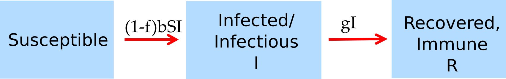

```{r, echo = FALSE}
#this code loads the settings file for the current app so we can automatically 
#list the functions in the further information section
currentrmdfile = knitr::current_input() 
currentappinfo = gsub("_documentation.Rmd" ,"_settings.R",currentrmdfile)
source(currentappinfo)
```


## Overview {#shinytab1}
This app explores how one should implement ID control measures for a scenario with multiple consecutive outbreaks. Read about the model in the "Model" tab. Then do the tasks described in the "What to do" tab. Before going through this app, you should go through the 'Reproductive Number' apps first. This app closely follows a model and analysis described in [@handel07a], see the "Further Information" tab for this and other related references.

### Learning Objectives
* Understand the concept of susceptible threshold level and how it relates to population immunity and the reproductive number.
* Learn what 'overshoot' is and how it happens in infectious disease interventions.
* See how optimal control measures for multiple outbreaks can differ from those for a single outbreak.


## The Model {#shinytab2}

### Model Overview
For this app, we'll use the basic compartmental SIR model. We include 3 different stages/compartments: 

* **S** - uninfected and susceptible individuals 
* **I** - infected and infectious individuals
* **R** - recovered/removed individuals

For this app, we specify the following processes/flows: 

* Susceptible individuals (S) can become infected by infectious individuals (I) at some rate, _b_. This leads to the susceptible individual leaving the S compartment and entering the I compartment.   
* Infected individuals recover and enter the recovered (R) compartment at some rate, _g_.
* Control measures are applied at some level _f_ (between 0 and 1) which reduces the rate at which new infections occur. Control measures start at time _tstart_ and end at time _tend_.
* A newly infected person enters the population at fixed time intervals given by _tnew_.

### Model Implementation
The flow diagram and the set of equations which are used to implement this model are as follows:

```{r multioutbreakdiagram,  fig.cap='Flow diagram for this model. ',  echo=FALSE}

```


$$\dot S = -(1-f) b SI$$ 
$$\dot I = (1-f)b S I$$
$$\dot R = g I$$

The parameter _f_ can be non-zero outside of the treatment interval given by _tstart_ and _tend_. At intervals _tnew_, the number of infected increases by 1. The simulation for this app also has one more feature. In previous apps, you learned that an unrealistic feature of models implemented by ordinary differential equations (ODE) is that the number of individuals can drop below 1, i.e., there could be a fraction of infected. For this app, the underlying code is such that if the number of infected drops below 1, it is set to 0. This is in some way a bit of a "hack" to deal with this issue. When you work through the stochastic apps, you will learn better ways of handling fractions in models. The advantage of using the "hack" is that we can keep using the ODE model formulation, without stochasticity, which makes things easy.


## What to do {#shinytab3}

__This app assumes knowledge of the reproductive number concept. If you are not familiar with it, please go through the 'Reproductive Number' apps first.__

_The tasks below are described in a way that assumes everything is in units of days (rate parameters, therefore, have units of inverse days). If any quantity is not given in those units, you need to convert it first._


### Task 1 
* Set the model to 1000 initial susceptible, 1 infected, no recovered.
* Set the recovery rate, _g_, such that it corresponds to an infectiousness duration of 5 days.  
* Set the infectiousness rate _b_ such that the model has a reproductive number, R~0~, of 4. If you don't know how to do that, please work through the _Reproductive Number_ apps first and then come back.
* Keep the intervention level, _f_, at 0 for now.
* Set _tmax_ and _tnew_ to 200. Values for _tstart_ and _tend_ do not matter since _f_ is 0.
* Run the simulation. You should get an outbreak with around 20 susceptibles left at the end.


### Task 2 
* First without running the simulation and using what you know about R~0~ and how it relates to the susceptible population size, figure out what the number of susceptibles is - assuming every other parameter stays the same - at which you don't get an outbreak anymore. 
* Now test your expectation by trying different values for _S_. You might have to adjust the simulation time to see this better.

This value for _S_ provides a threshold below which we don't get an outbreak. This, of course, directly corresponds to the threshold value for R~0~ which you learned about previously. 

### Task 3 
The threshold value below which you do not get an outbreak is around 250 for the parameter settings here. However, in the first task, the number of susceptibles left at the end of the outbreak was much less, around 20. The outbreak 'overshoots' by depleting more susceptibles than the threshold value. Why is that? Think about what happens at the peak of the outbreak when R~0~ switches from being larger than 1 to smaller than 1. Does the outbreak stop immediately? Why not? 

### Task 4 
For a single outbreak, more control is better. We can test that.

* Using the same number of susceptibles, infected and recovered from __Task 1__. 
* Set control to start at time 0 (_tstart_) and end at 200 (_tend_).
* Set _tmax_ and _tnew_ both to 200.
* Slowly increase control, _f_ (e.g. in steps of 0.1). Run the simulation for each value of _f_. As _f_ increases, you should see smaller outbreaks until you hit a value of _f_ for which you don't see outbreaks anymore. Understand how this value of _f_ relates to the reproductive number.

### Task 5 
For multiple outbreaks, more control is not necessarily better. Let's explore that.

* Set control end to 100 (_tend_). All of the other settings should be the same as the previous task.
* Slowly increase control, _f_ and run the simulation for the different values of _f_. Initially, things look as before. But once you reach a certain level of control, you will see that a second outbreak occurs and the total number of susceptibles drops again.
* To explore this in more detail, set f=0.55 and f=0.6 and try to understand why in one case you only get a single outbreak and in the other you get 2.
* Run the simulation for _f=0.2-0.7_ (in steps of 0.1) and record the number of susceptibles left at the end of the simulation. Based on that, what do you conclude about the impact of different levels of control on the outcome? What seems to be the best level of control, and why? 


### Task 6 
In the previous task, control ends while there are still a few infected around, which can lead to a second outbreak. An alternative scenario is one where control ends after infected are gone, but then a newly infected person enters the population. We can explore this scenario, as well.

* Using the same number of susceptibles, infected and recovered from __Task 5__.
* Set control to start at time 0 (_tstart_) and end at 250 (_tend_), control strength to _f=0.7_.
* Set _tmax_ and _tnew_ to 500.
* Run the simulation, you should see a single outbreak with around 686 susceptibles left.
* Now set _tnew=300_. That means at time 300 a newly infected individual enters the population. You'll see another outbreak. Make sure you understand why.
* Try the above again with _f=0.6_. You should see a bigger first and smaller second outbreak.
* Try the above again with _f=0.5_. This time you will only get one initial outbreak.
* Compare the number of susceptibles left at the end of the simulation for _f=0.3, 0.5_ and _f=0.7_. Think about why it is again that for some levels of control, you get a single outbreak and for some, you get more than one, and what that means for optimal intervention strength. You should come to the same conclusions as in the previous task.


## Further Information {#shinytab4}
* This app (and all others) are structured such that the Shiny part (the graphical interface you see and the server-side function that goes with it) calls an underlying R script (or several) which runs the simulation for the model of interest and returns the results.
* For this app, the underlying function(s) running the simulation are called ``r appsettings$simfunction``. You can call them directly, without going through the shiny app. Use the `help()` command for more information on how to use the functions directly. If you go that route, you need to use the results returned from this function and produce useful output (such as a plot) yourself. 
* You can also download all simulator functions and modify them for your own purposes.  Of course, to modify these functions, you'll need to do some coding.
* For examples on using the simulators directly and how to modify them, read the package vignette by typing `vignette('DSAIDE')` into the R console.
* This app closely follows a model and analysis described in [@handel07a]. Similar ideas applied to drug sensitive and drug-resistant influenza strains are discussed in [@lipsitch07; @alexander07; @handel09a].

### References


