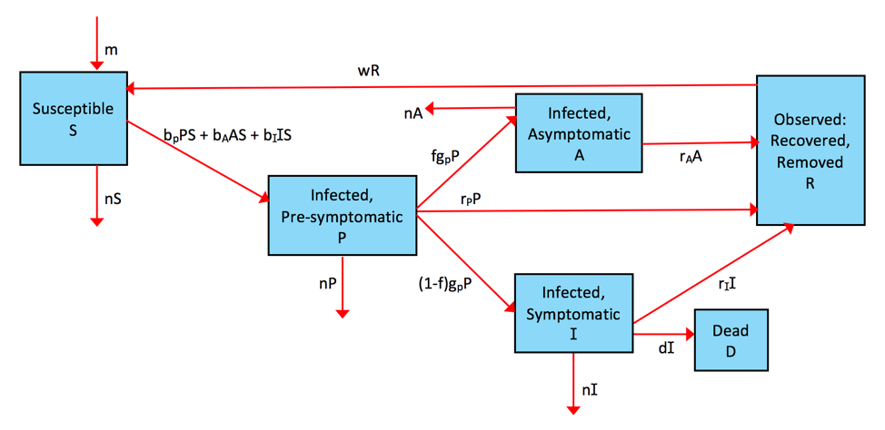

```{r, echo = FALSE}
#this code loads the settings file for the current app so we can automatically 
#list the functions in the further information section
currentrmdfile = knitr::current_input() 
currentappinfo = gsub("_documentation.Rmd" ,"_settings.R",currentrmdfile)
source(currentappinfo)
```


## Overview {#shinytab1}
This app teaches the topic of _Infectious disease surveillance_ and demonstrates the effect of the type and extent of surveillance on the dynamics of an infectious disease in a population, including the course and outcome of an epidemic. Read about the model in the "Model" tab. Then do the tasks described in the "What to do" tab. 

### Learning Objectives

* Understand the influence of infectious disease surveillance on the dynamics of an infectious disease in a population by comparing disease dynamics with and without surveillance.

* Understand the effect of the extent of surveillance and under-reporting/incomplete surveillance [@brabazon15; @kazerooni18; @jelastopulu10]on the course and outcome of the epidemic. The effect of the extent of surveillance on the number of susceptibles left at the end of the simulation and the total number of deaths that occurred will be explored. In addition, users will explore which surveillance parameters prevent the occurrence of an outbreak.

* Understand influence of the type of surveillance (e.g., one that detects presymptomatic, asymptomatic or symptomatic infections or pairwise combinations of the three or all) on disease dynamics. The effect of the type of surveillance will be explored in the case where individuals in the different stages of infection (presymptomatic, asymptomatic or symptomatic) transmit or don't.


## The Model {#shinytab2}

### Model Overview

For this compartmental model, we track the following compartments/stages:

* **S** - susceptible, uninfected individuals 
* **P** - presymptomatic individuals who are infected and do not yet show symptoms. Those individuals can potentially be infectious.
* **A** - asymptomatic, infected individuals. Those individuals can potentially be infectious.
* **I** - individuals who are infected and show symptoms. Those individuals are likely infectious, but the model allows to adjust this, including no infectiousness.
* **R** - Observed/removed individuals. Those individuals have been observed/detected by the surveillance system and have been removed from the transmission cycle.
* **D** - Individuals who die from disease. Only symptomatic individuals are assumed to die from disease.

The model can be extended to include a **reported** compartment. This compartment would represent for example the US Centers for Disease Control and Prevention (CDC) to which health systems report the observed cases of disease at some rate(s). 

In addition to specifying the *compartments* of a model, we need to specify the dynamics determining the changes for each compartment. In general, more compartments leads to more processes and more parameters governing these processes.

For this model, we include the following processes: 

* Susceptible individuals (S) can become infected by presymptomatic (P), asymptomatic (A) or symptomatic (I) hosts. The rates at which infections from the different types of infected individuals (P, A and I) occur are governed by 3 parameters, _bP_, _bA_, and _bI_. In other words, those b~i~ parameters determine how infectious an individual in stages P, A and I is.
* All infected individuals first enter the presymptomatic stage. They remain there for some time (determined by rate _gP_, the inverse of which is the average time spent in the presymptomatic stage i.e., the latent period). A fraction _f_ of presymptomatic hosts move into the asymptomatic category, and the rest become symptomatic infected hosts.
* Asymptomatic infected hosts are removed by surveillance after some time (specified by the rate _rA_). 
* Similarly, infected symptomatic hosts and presymptomatic hosts leave that stage at rate _rI_ and _rP_ respectively.
* Removed individuals recover from the infection and are initially immune to reinfection. They can loose their immunity at rate _w_ and return to the susceptible compartment.
* New susceptibles enter the system/model at a fixed rate m. From each compartment (apart from the observed/removed compartment), hosts “leave” after some time (i.e. they die) at rate _n_. The inverse of this rate is the average lifespan of a host. In addition, infected symptomatic individuals can die due to the disease at rate _d_.


### Model Implementation
The flow diagram and the set of ordinary differential equations (ODE) which are used to implement this model are as follows:

```{r multioutbreakdiagram,  fig.cap='Flow diagram for this model. ',  echo=FALSE}

```


$$\dot S = m - S(b_P P + b_A A + b_I I) + wR - nS$$ 
$$\dot P = S (b_P P + b_A A + b_I I) -  P(g_P + r_P + n) $$ 
$$\dot A = f g_P P - A(r_A + n) $$ 
$$\dot I = (1-f) g_P P - I (r_I + n + d) $$ 
$$\dot R = r_PP + r_A A + r_I I - wR $$
$$\dot D = dD$$


## What to do {#shinytab3}

**The tasks below are described in a way that assumes everything is in units of months  (rate parameters, therefore, have units of inverse months). If any quantity is not given in those units, you need to convert it first (e.g. if it says a year, you need to convert it to 12 months).**

### Task 1:
* Set the model parameters such that it corresponds to the following setting: 
    * A population size, _S_, of 2000, 1 initially infected presymptomatic host, _P_, simulation duration _tmax_ = 50 years. Be sure to convert the units to months.
    * Assume that only symptomatic individuals transmit, at rate _bI_ = 0.002.
    * Assume that _gP_ = 5. The inverse of this parameter is the average duration of the presymptomatic period.
    * Assume that 20% of the infections are asymptomatic. Accordingly set _f_ = 0.2.
    * Assume that immunity wanes at a rate _w_ = 1/100.
    * Set the natural death rate, n, to a value that corresponds to an average lifespan of 41 years. Recall that the unit of n needs to be in 1/months. You need to convert lifespan to months, then take the inverse to get the death rate. Round to the first significant digit (i.e. 0.00X).
    * Set the birth rate to _m_ = 5 per month and the death rate _d_ = 0.5.
    * Also assume that no surveillance is done. Accordingly set the surveillance parameters _rP_, _rA_ and _rI_ to zero.  
* With parameters set to correspond to the scenario just described, run the simulation and ensure that you observe oscillations/cycles (i.e. repeated outbreaks). Record the final number of susceptibles (i.e., _S~f~_). Also record the final value of the disease induced deaths (i.e., _D~f~_).

### Task 2: 
* Surveillance ensures that diseased individuals are removed from the transmission cycle before they contribute to the next generation of cases. Assume that there exists a surveillance system that detects only symptomatic infections. Set the rate of surveillance of symptomatic hosts, _rI_ to 0.5. Leave the rest of the settings as in task 1.
* Run the simulation and record _S~f~_ and _D~f~_.
* Compare this result with the result observed in task 1 so as to understand the effect of surveillance on the course of the epidemic.


### Task 3: 
* Now run the model with increasing surveillance by setting _rI_ = 0.5, 1, 1.5, and 2. Record _S~f~_ and _D~f~_ for each simulation.
* Part 1: Plot (either by hand or using the computer) a graph of _rI_ versus _S~f~_ to determine the effect of the extent of surveillance on the number of susceptibles left at the end of the simulation.
* Part 2: Also plot (either by hand or using the computer) a graph of _rI_ versus _D~f~_ to determine the effect of the extent of surveillance on the total number of deaths that occurred.


### Task 4: 
* Start with the settings in task 2.
* Part 1: Consider the case where asymptomatic individuals transmit, and they do so at a rate similar to that of symptomatic hosts, i.e., _bA_ = 0.002 but no surveillance for them is done. Run the simulation and record _S~f~_. Compare this result with that in task 2.
* Part 2: Now consider the case where a new surveillance system detects asymptomatic cases at the same rate as that of symptomatic cases, i.e., _rA_ = 0.5 in addition to surveillance of symptomatic cases. Also in this case, assume that asymptomatic cases transmit at a rate similar to that of symptomatic hosts, i.e., _bA_ = 0.002. Run the simulation and record _S~f~_. Compare this result with that in task 4 part 1.
* Part 3: Only modify one thing i.e., consider the case where asymptomatic individuals don't transmit, i.e., _bA_ = 0. Run the simulation and record _S~f~_. Compare your result with that in task 4 part 1 and part 2.


### Task 5: 
* For some infectious diseases, such as tuberculosis (TB), it is possible to control the epidemic by identifying latently infected individuals i.e., while at the presymptomatic stage. These can be given Preventive Therapy so as to reduce the number of individuals transitioning to infectiousness.
* Part 1: Consider the case where surveillance is done for asymptomatic, symptomatic and presymptomatic individuals at the same rate (i.e., 0.5). Also assume that asymptomatic individuals don't transmit, as the case is with TB. Leave the other settings as in task 1.
Run the simulation and record _S~f~_. Compare the value of Sf in this simulation with those in the other tasks.
* Part 2: Play with the rates of disease detection ( _rP_ , _rI_, and _rA_) and explore their effect on the disease dynamics. For example, you can consider the case where the rate of detection of asymptomatic hosts is lower than the rate of detection of symptomatic hosts. This is usually the case. Continue exploring. In your exploration, which individual detection rate values ( _rP_ , _rI_, and _rA_) or a combination of detection rates prevent the occurrence of an outbreak? 


## Further Information {#shinytab4}
* This app (and all others) are structured such that the Shiny part (the graphical interface you see and the server-side function that goes with it) calls an underlying R script (or several) which runs the simulation for the model of interest and returns the results.
* For this app, the underlying function(s) running the simulation are called ``r appsettings$simfunction``. You can call them directly, without going through the shiny app. Use the `help()` command for more information on how to use the functions directly. If you go that route, you need to use the results returned from this function and produce useful output (such as a plot) yourself. 
* You can also download all simulator functions and modify them for your own purposes.  Of course to modify these functions, you'll need to do some coding.
* For examples on using the simulators directly and how to modify them, read the package vignette by typing `vignette('DSAIDE')` into the R console.

### References


