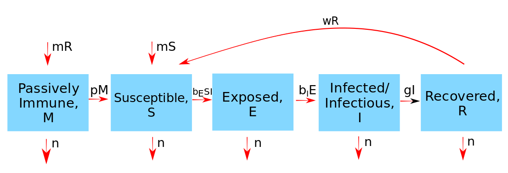

```{r, echo = FALSE}
#this code loads the settings file for the current app so we can automatically 
#list the functions in the further information section
currentrmdfile = knitr::current_input() 
currentappinfo = gsub("_documentation.Rmd" ,"_settings.R",currentrmdfile)
source(currentappinfo)
```


## Overview {#shinytab1}
This app will teach you about the concept of passive immunity through the utilization of an MSEIR type model. It will also show you how variable population size can affect disease dynamics. You can read more in-depth information about the model in the "Model tab". Tasks that will help you understand the model and concept are present in the "What to do" tab".

## The Model {#shinytab2}

### Model Overview
For this app, we will use the MSEIR type compartmental model. This model covers the concept of passive immunity, where a number of newborns receive maternal antibodies from their mother, which protects them from a disease for a short amount of time. We allow for 5 different compartments:

*  __M__ - individuals that are protected by maternal antibodies
*  __S__ - susceptible individuals
*  __E__ - exposed individuals whom are not yet infectious
*  __I__ - infectious individuals
*  __R__ - recovered individuals

In this model, we will allow for the population size to be dynamic. Because of that, N will represent the total population size at any given time. The dynamic model for N is shown below.

The following processes define the dynamics of the model:

* Newborns either enter the maternally protected (M) compartment or the susceptible (S) compartment based on the status of the mother. Newborns of susceptible mothers enter the S compartment at a flow of $mS$, where $m$ is the birth rate. All other newborns enter the M compartment at a flow of $mR$, where R represents the recovered individuals.  Note that the total population size is dependent on the birth rate ($m$) and death rate ($n$). 
* Individuals that are protected by maternal antibodies move into the S compartment at a flow determined by the length of maternal protection. In this model, this rate is represented by $p$.
* Susceptible individuals move from the S compartment to the exposed (E) compartment at a flow dependent on the contact rate of the population, $b_E$. Individuals in the E compartment are infected with the disease, but not yet infectious to other individuals.
* Exposed individuals stay in the E compartment during the latent period ($b_I) of the disease and are moved out of the E compartment at a flow of $b_I E$.
* After individuals enter the infected/infectious (I) compartment, the rate at which they move out of this compartment is dependent on the recovery rate of the disease ($g$). Individuals move into the recovered (R) compartment at a flow of $g R$. The waning immunity rate is defined by $w$. If $w > 0$ then the model turns into an MSEIRS model where recovered individuals flow into the S compartment at a rate of $w$.
* Individuals who have died move out of each compartment at a rate $n$.


### Model Diagram

The following shows the general flow diagram for the presented MSEIR model:


```{r maternalimmunityfigure,  fig.cap='Flow diagram for this model. ',  echo=FALSE}

```


### Model Equations

The following set of differential equations dictates the relationship described above:

$$\dot M = mR- (p + n)M$$ 
$$\dot S = mS + p M - b_E S I / N - nS + w R$$ 
$$\dot E = b_E S I / N - (b_I + n)E$$
$$\dot I = b_I E - (g + n)I$$
$$\dot R = g I - (w + n)R$$
$$N = M + S + E + I + R$$
Here, N is dependent on $m$ and $n$. This means that population size is subject to change over time depending on the values of these parameters. The population is growing if $m > n$, decaying if $m < n$, and constant if $m = n$. It is also important to note that transmission rate is scaled with the population size. This is a different feature than in other apps in this package.


## What to do {#shinytab3}

In most traditional types of models (and models in this package), total population size remains constant. However, this is not always the case when the natural birth and death rates are not balanced. This also occurs when disease-related death is high. Some examples of diseases like this are the plague, measles, smallpox, malaria, and tuberculosis. This app will show the dynamic of a MSEIR model with examples shown of constant population size and dynamic population size. It is important to consider the fact that when considering an exponentially increasing/decreasing population size, parameters need to be carefully selected so that the model retains biological relevance.

**The tasks below are described in a way that assumes everything is in units of days (rate parameters, therefore, have units of inverse days). If any quantity is not given in those units, you need to convert it first (e.g. if it says a week, you need to convert it to 7 days).**

### Task 1

First we will observe the dynamics of the MSEIR model with a constant population size.

* Set the simulation to run for 225 days. 
* Start with an initial susceptible population, $S_0$, of 1000, and 1 initial infected and symptomatic host.
* Set the death rate, *n*, so that it corresponds with an average lifespan of 50 years.
* Set the birth rate, *m*, so that it is equal to the calculated death rate.
* Set the passive immunity rate, *p*, so that maternal antibodies wear off on average in 6 months. 
* Set the contact rate, $b_E$, to 0.3 and the latent period rate, $b_I$, so that it corresponds to an average latent period of 14 days.
* Set the rate of recovery, *g*, so that it corresponds to an average recovery period of 25 days.
* Set the waning immunity rate to 0. This would be applicable for an infection that confers permanent immunity, like measles or rumps.

Now run the simulation. Make sure that an outbreak occurs. What can you observe from the results? Make sure to take note of the relationship between the M population and the S population. Also make note of the final number of infecteds.

### Task 2

Run the simulation with the same parameters as in Task 1, except this time run it for 1200 days to observe the long term dynamics at place. What do you notice? Does the population reach steady state? What does this say about the dynamics at place?


### Task 3

Sometimes it is not appropriate to assume that a population will be constant over a period of time. Here, we will observe what kind of effect an exponentially increasing population would have on the dynamics of the MSEIR model. 

* Set the parameters equal to the values that they were in Task 1.
* Change the birth rate, m, to 0.025.
* Change the contact rate, $b_E$, to 0.75.

Compare the effects of an increasing population to what you saw in Task 1. How does the increasing population affect the M population and the S population. Does it appear that this is an endemic disease?

### Task 4 

Now we will compare the effects of a decreasing population on disease dynamics with an MSEIR model.

* Set the parameters equal to the the values that they were in Task 1.
* Change the death rate to 0.0209.
* Change the contact rate, $b_E$, to 0.75.

How do these results compare to those in Task 3. What compartments are most affected by the decreasing population?

### Task 5

Now we are going to observe what disease dynamics are like with a short latent period and a short recovery period. We will observe the long term dynamics of such a disease by doing the following:

* Set the simulation to run for 2000 days. 
* Start with an initial susceptible population, $S_0$, of 1000, and 1 initial infected and symptomatic host.
* Set the death rate, *n*, and birth rate, *m*, to 0.02.
* Set *p* to 0.0041, $b_I$ to 0.17, and *g* to 0.238. Think about what these rates mean about the biology that is occurring here.
* Keep *w* at 0 for now.
Play around with the $b_E$ parameter. Find a level for $b_E$ where there are multiple peaks in the I compartment over the 2000 days. What is occurring in the other compartments to allow for these peaks?

### Task 6

Set the simulation to run with the same parameters used in Task 5, including the $b_E$ values that was used. Adjust the value for the waning immunity parameter, *w*. What do you observe? What compartments are especially affected by increasing this parameter to > 0? Hint: you will likely need to decrease the *tmax* parameter.

## Further Information {#shinytab4}
* This app (and all others) are structured such that the Shiny part (the graphical interface you see and the server-side function that goes with it) calls an underlying R script (or several) which runs the simulation for the model of interest and returns the results.
* For this app, the underlying function(s) running the simulation are called ``r appsettings$simfunction``. You can call them directly, without going through the shiny app. Use the `help()` command for more information on how to use the functions directly. If you go that route, you need to use the results returned from this function and produce useful output (such as a plot) yourself. 
* You can also download all simulator functions and modify them for your own purposes.  Of course to modify these functions, you'll need to do some coding.
* For examples on using the simulators directly and how to modify them, read the package vignette by typing `vignette('DSAIDE')` into the R console.
* Further information about this topic can be found in [@hethcote00].

### References


