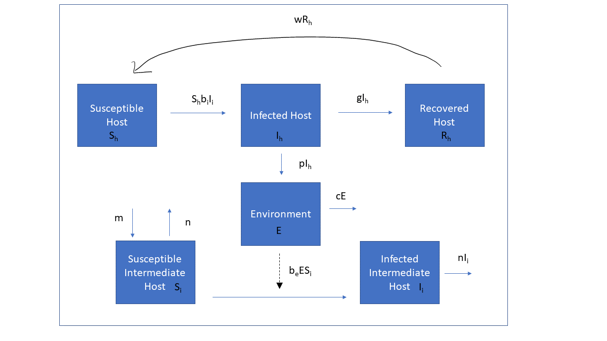

```{r, echo = FALSE}
#this code loads the settings file for the current app so we can automatically 
#list the functions in the further information section
currentrmdfile = knitr::current_input() 
currentappinfo = gsub("_documentation.Rmd" ,"_settings.R",currentrmdfile)
source(currentappinfo)
```


## Overview {#shinytab1}
This app allows you to explore transmission dynamics for parasites. Specifically, this app focuses on parasites with indirect life cycles which used intermediate hosts to complete their life cycle. Parasites are an extremely diverse group of organisms that can cause disease in plants and animals. Any organism that lives on or in another organism and derives its nutrients from that organism at the host’s expense can be considered a parasite. However, we are going to focus on classic parasitic diseases of vertebrates which are commonly caused by helminths and protozoa. There are an estimated 75,000 to 300,000 parasitic helminths of vertebrate hosts compared to the approximately 66,200 species of vertebrates described i.e. fish, reptiles, amphibians, birds, and mammals [@dobson08].  

In addition to the abundant species diversity of parasites, there is a lot of variation in reproductive strategies. Life cycles of parasites are broadly categorized as direct or indirect. Parasites with direct life cycles only require one host to reach sexual maturity and produce progeny. Compared to parasites with indirect life cycles which require at least one intermediate host to complete their life cycle. Some parasites with indirect life cycles require more than one intermediate host for development.

To learn more about the model in detail read the description in the "Model" tab and then do the tasks described in the "What to do" tab.

### Learning Objectives
* Learn about different parasites and their transmission dynamics.

## The Model {#shinytab2}

### Model Overview and Background Information
In this model we will only be looking at a simple indirect life cycle with 2 species (a host and an intermediate host), using the basic SIR compartmental model.

The model has the following compartments:  

* **S~h~** - uninfected and susceptible definitive hosts 
* **I~h~** - infected/infectious definitive hosts
* **R~h~** - recovered/removed hosts
* **E**  - parasites present in the environment 
* **S~i~** - susceptible intermediate hosts
* **I~i~** - infected/infectious intermediate hosts

Assumptions:

We assume that once an intermediate host is infected, it stays infected until it dies. Therefore, recovered intermediate hosts are not included in the model. Additionally, we assume the time scale for this model is short enough that we can ignore the birth and death rates for definitive hosts. This is likely an appropriate assumption as long as our simulation is only a couple years. This model would not be good for chronic parasitic infections that persist for a long time e.g. echinococcosis, chronic schistosomiasis, and paragonimiasis [@manfras02; @olveda14; @walker05].


The processes being modeled are:

* Susceptible definitive hosts can only become infected by contact with infected intermediate host at rate _b~i~_ 
* Susceptible intermediate hosts can only become infected through contact with parasites in the environment at rate _b~e~_ 
* Infected definitive hosts recover after some time (specified by the rate _g_) and recovered definitive hosts lose their immunity at rate _w_. 
* New susceptible intermediate hosts are born at a rate _m_. Susceptible and infected intermediate hosts die at rate _n_. The inverse of this rate is the average lifespan. 
* Infected hosts shed parasites in the environment at a rate _p_ and they decay in the environment at a rate _c_.

We envision this model being flexible allowing hosts to represent a wide range of definitive and intermediate hosts with the one caveat that intermediate hosts are not intended to represent vectors, like mosquitoes, which can act as intermediate hosts for parasites.


### Model Diagram
The flow diagram and the set of ordinary differential equations (ODE) which are used to implement this model are as follows:


```{r multioutbreakdiagram,  fig.cap='Flow diagram for this model. ',  echo=FALSE}

```

### Model Equations

$$\dot S_h = - S_h b_i I_i + w R_h$$ 
$$\dot I_h = S_h b_i Ii  - g I_h$$ 
$$\dot R_h = g I_h - w R_h$$
$$\dot E   = p I_h - c E$$
$$\dot S_i = (m-n) S_i - b_e S_i E$$ 
$$\dot I_i = S_i b_e I_h  - n I_i$$ 


## What to do {#shinytab3}

**The tasks below are described in a way that assumes everything is in units of MONTHS (rate parameters, therefore, have units of inverse months). If any quantity is not given in those units, you need to convert it first (e.g. if it says a year, you need to convert it to 12 months).** 

### Task 1
In the first task we are going to use _Dracunculus medinensis_ as an example. This parasitic nematode is the causative agent of Dracunculiasis also know as the Guinea worm. Humans are infected through the consumption of water containing infected copepods, the intermediate host. You can read more about Guinea worm and see a diagram of its life cycle [on this CDC website](https://www.cdc.gov/parasites/guineaworm/biology.html).


* Set the model parameters such that it corresponds to the following setting:
    * 1000 initially susceptible for both hosts and intermediate hosts, 0 initially infected host, 1 infected intermediate host, and 0 initial pathogens in environment, simulation duration approximately 5 years. (Remember to convert to months)
    * Set the environmental transmission rate, _b~e~_=0 and intermediate host to definitive host transmission, _b~i~_ = 0.2.
    * Assume that the duration of the infectious period in hosts is a month long. (Hint: The rate of recovery is the inverse of the infectious period).
    * Assume that intermediate hosts live for year. (Hint the death rate is the inverse of the life span).
    * Set the birth rate such that in the absence of the disease, you get a steady population of 1000 intermediate host. (Hint: Birth rate needs to be significantly larger than death rate to achieve a steady state. You can leave the transmission rates at zero to see the effect of changing birth rates.)
    * Set waning immunity, the rate the parasite is shed into the environment, and the decay of the parasite in the environment to zero.
    * Run the simulation, observe what you get.
  * You should get a 91 as the final number of susceptibles and maximum number of infected hosts of 123 but the number of infected intermediate hosts does not exceed 1.
  * Make sure you know why. 
    + Hint: Look at the number of parasites in the environment. You should notice that there are no parasites being shed into the environment and no environmental transmission so the number of infected intermediate hosts cannot exceed the initial value, _I~i~_.

### Task 2
In the scenario above the death rate of the intermediate host was set at 0.083, which is equivalent to a year lifespan. Copepods typically lifespan can be anywhere from 150 days to a year [@kurtz07].

* Repeat the simulation with the parameters above but now use the lower limit of the copepods lifespan to set the death rate (assuming 30 days in a month). Don’t forget to adjust the birthrate to get a steady population of 1000 susceptible intermediate hosts.
    * You should see a four-fold increase in the final number of susceptibles, 368. Do you understand why increasing the death rate of intermediate hosts decreases the number of infected hosts?


### Task 3
For the following tasks we will be using _Taenia multiceps_ as an example. _T. multiceps_ is a type of tapeworm that infects dogs and requires a rabbit or ruminant intermediate host. This not to be confused with _Dipylidium caninum_, the flea tapeworm, which is commonly associated with domestic dogs and requires a flea as intermediate host and is transmitted to the dog via ingestion of the infected flea. Anthelmintics, or dewormers, are commonly used to control worm burdens and shedding in pets and livestock. In this scenario we will explore how host shedding impacts transmission dynamics.
You can read more about _T. multiceps_ and see a diagram of its life cycle [on this CDC website](https://www.cdc.gov/dpdx/coenurosis/index.html).


* Repeat the simulation with the parameters above but set the intermediate host to definitive host transmission rate, _b~i~_ = 0.1 environmental transmission rate, _b~e~_=0.1
  * Did anything change? Nothing should change because there are still no parasites in the environment.
  * Now set the rate at which an infected host sheds parasites into the environment _p_ = 1. 
  * Try different values for _p_ (0.5 and 0.1) and observe the maximum numbers for _E_ and _I~h~_.
  *	What value do you need to set _p_ to prevent 50% of the susceptible intermediate hosts from getting infected?
  * Does it make biologic senses why you are seeing a decrease in the number of infected intermediate hosts and infected hosts as parasite shedding decreases? 

Using anthelmintics is a common why to reduce the worm burden in a host and the number of eggs being shed into the environment. Fecal egg counts are often used to assess the effectiveness of a drug and determine if resistance is presence. Parasites should be considered susceptible to a drug if there is a 90% reduction in eggs compared to a pretreatment fecal egg count [@mckenna90].
  

### Task 4
In addition to reducing worm burdens and shedding, treating with anthelmintics can shorten the infectious period and increase the recovery rate. While, treatments can increase the recovery rate drugs like steroids, which are immunosuppressive can prolong the recovery rate. 

* Keep all parameters the same as above and leave the _p_ as the value you determined resulted in 50% of susceptibles remaining uninfected ( _p_ = 0.002). 
  * Adjust the recovery rate to reflect an infectious period of 2 weeks (Remember to convert to months) and record the final number of susceptible intermediate hosts and infected intermediate hosts. 
  * Now set the recovery rate to reflect an infectious period of two months and compare the final number of susceptible intermediate hosts and infected intermediate hosts to values obtained above. Is it clear why a slower recovery rate increases the number of infected intermediate hosts? If not take a look at the maximum number of infected hosts for each scenario.


### Task 5 
For this task we are going to use two examples, _Toxoplasma gondii_ and _Heterakis gallinarum_. Both parasites have a direct and indirect life cycle. For the purpose of this exercise we will only look at the indirect life cycle. _T. gondii_ is a protozoa and the causative agent of Toxoplasmosis. Felines are the definitive host and small rodents are the intermediate hosts. Oocysts can survive in the environment for up to 90 days [@lindsay02]. Compared to _H. gallinarum_, a nematode which serves as a vector for a protozoal disease in turkeys called Histomoniasis. Poultry are the definitive host of _H. gallinarum_ and earthworms serve as the paratentic host, or an intermediate host that is not required for development but essential for completing the life cycle and transmitting the parasite to the definitive host. While 90% of the eggs survive 20 to 40 days in the environment, a small proportion can survive up to 2 years [@thapa17].

* Keep the number of susceptible hosts and intermediate hosts the same, 1000.
* Change the initial number of infected intermediate hosts to 0 and the initial number of infected hosts to 1.
* Change the rate transmission from intermediate hosts to 0.1 and leave the environmental transmission rate as before. 
*Set the rate of infected host shedding in the environmental to 1. Keep the birth death rate the same as above and use the recovery rate for a 2-week infectious period. 
* Run the simulation and record the final number of   _I~h~_, _S~i~_, _I~i~_, and _E_. 
 * Now set the rate of parasite decay in the environment so it corresponds to the environmental survival time of _T. gondii_ described above (Hint: Remember to convert to months and the rate of decay will be the inverse of the survival time.) Record the final number of _I~h~_, _S~i~_, _I~i~_, and _E_. 
* Now change the rate of parasite decay in the environment so that it corresponds to the maximum environmental survival time for _H. gallinarum_. 

What effect does increasing the duration a parasite persists in the environment have on the number of susceptible intermediate hosts? Why do you see an initial decrease in susceptible intermediate hosts then an increase? (Hint: Look at the number of parasites in the environment. As the number of parasites in the environment decreases the number of susceptible intermediate hosts increases as new individuals are born). 

### Task 6
Up onto this point we have not changed the rate of waning immunity and have assumed that once an infected host recovers, they have a lasting protective immunity. However, in reality it is very common for a host to loss its protection against reinfection as time progresses. In this scenario we will observe the effects that waning immunity has on outbreak dynamics. It may be necessary to shorten the duration of the simulation time from 5 years to half year to visualizes the graphs well. 

* Set the rate of decay to 0.5. Leave all other parameters same and set the initial number of infected intermediate hosts back to 1. Record the final observe counts for _I~h~_, _R~h~_, and _E_.
  * Now turn on waning immunity. Record the final values _I~h~_, _R~h~_, and _E_ when w is set to 0.5 , 1, and 2
  * Can you explain this pattern? Why do the number of parasites in environment increase when waning immunity exceeds duration of disease? (Hint: Think about the movement of an individual host through compartments and the parameters that affect them. As the rate of waning immunity increases more individuals move from the recovered class to susceptibles. You should observe a decrease in the final number of recovered individuals and an increase in the final number of infected as the duration of immunity is shortened. Additionally, the number of parasites in the environment increases as waning immunity increases, why? The number of parasites increases because the number of infected individual increases resulting in more parasites being shed into the environment.
  
### Task 7
We are going to use the previous example of _T. gondii_ in the next task to assess the effects of transmission from an intermediate host to host on outbreak dynamics. There have been many parasites that have been studied because of their ability to modify a host’s behavior to increase transmission. _T. gondii_ is one such parasite that has been documented to alter rodent behavior to decrease their fear of felines and make them more prone to predation which increases transmission potential [@vyas07].

* Keep the number of susceptible hosts and intermediate hosts the same, 1000, and change the duration of time simulation to 2 years (convert to months).
* Set the initial number of infected intermediate hosts to 1, the initial number of infected hosts to 0, and the number of parasites in the environment to 0. 
* Change rate of parasites shedding into the environment to 0.1 and the recovery rate to 1 month. Set the waning immunity and parasite decay in the environment to zero. Keep all other parameters the same.
* Set the transmission of intermediate hosts to hosts = 0.001 and record the maximum number of infected hosts. 
	* Now try increasing the transmission _b~i~_ to 0.01 and 0.1. Compare the maximum number of infected hosts for each scenario. 

The number of infected hosts increases as transmission rate increases and the time at which peak infection occurs decreases. Vaccines typically target transmission. Compare your results to those in task 3 where you altered the rate pathogens are shed into the environment. Does decreasing the transmission rate have more of impact on the number of infected hosts than decreasing parasite shedding?

### Task 8 
In the following task we are going to look at the effects the number of parasites in the environment has on transmission dynamics. Environmental stages are extremely important and typically where the parasites are most vulnerable to degradation due to abiotic factors like temperature and precipitation. Additionally, favorable environmental conditions can decrease the development time required to become infective which can increase the rate of transmission.

* Keep the simulation time at 2 years and set the number of infected hosts to 0 and infected intermediate host to 0. Keep environmental transmission set to 0.1 and set intermediate host transmission to 0.1. Keep all other parameters the same as above.
* Now set the initial value of parasites in the environment E = 1. Then try 10 and 100 and record the final number of parasites in environment (You should observe very little change). 
* Now try set the _E_= 10 and changing the values, one at a time, for host environmental shedding and environment to intermediate host transmission. Which parameter has a bigger impact on the number of parasites in the environment?

Why do you think the initial number of parasites in the environment has little effect in the overall total of parasites in the environment? Think about the life cycle of a parasite. They require the definitive host for sexual reproduction. The physiologic processes in the host impact the number of parasites being shed in the environment. Increasing the rate of parasites shed into the environmental increases the number of parasites and the number of infected hosts. Increasing the environmental transmission to intermediate hosts increases the number of infected hosts but not the number of parasites in the environment. 

## Further Information {#shinytab4}
* This app (and all others) are structured such that the Shiny part (the graphical interface you see and the server-side function that goes with it) calls an underlying R script (or several) which runs the simulation for the model of interest and returns the results.
* For this app, the underlying function(s) running the simulation are called ``r appsettings$simfunction``. You can call them directly, without going through the shiny app. Use the `help()` command for more information on how to use the functions directly. If you go that route, you need to use the results returned from this function and produce useful output (such as a plot) yourself. 
* You can also download all simulator functions and modify them for your own purposes.  Of course to modify these functions, you'll need to do some coding.
* For examples on using the simulators directly and how to modify them, read the package vignette by typing `vignette('DSAIDE')` into the R console.

### References


