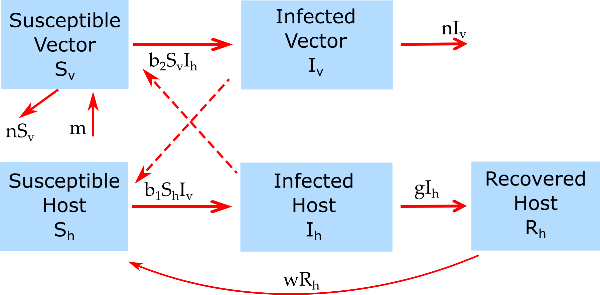

```{r, echo = FALSE}
#this code loads the settings file for the current app so we can automatically 
#list the functions in the further information section
currentrmdfile = knitr::current_input() 
currentappinfo = gsub("_documentation.Rmd" ,"_settings.R",currentrmdfile)
source(currentappinfo)
```


## Overview {#shinytab1}
This app allows you to explore a simple model for vector-borne transmission. Read about the model in the "Model" tab. Then do the tasks described in the "What to do" tab.


## The Model {#shinytab2}

### Model Overview

This is a simple 2 species (hosts and vectors) model, using the basic SIR framework as follows.

The model has the following compartments:  

* **Sh** - uninfected and susceptible host 
* **Ih** - infected/infectious hosts
* **Rh** - recovered/removed hosts
* **Sv** - susceptible vectors
* **Iv** - infected/infectious vectors

We assume that once a vector is infected, it stays infected until it dies. Therefore, recovered vectors are not included in the model.


The processes being modeled are:

* Susceptible host can become infected by contact with infected vectors at rate _b~1~_ 
* Susceptible vectors can become infected by contact with infected hosts at rate _b~2~_ 
* Infected hosts recover after some time (specified by the rate _g_). 
* New susceptible vectors are born at a rate _b_. Susceptible and infected vectors die at rate _n_. The inverse of this rate is the average lifespan. 
* Recovered hosts lose their immunity at rate _w_.

We envision hosts to be humans and vectors to be e.g. mosquitoes. We further assume the time scale for the model is short enough that we can ignore births and deaths for human hosts but not vectors. This is likely a decent approximation as long as our simulation time is only a few years.


### Model Implementation
The flow diagram and the set of ordinary differential equations (ODE) which are used to implement this model are as follows:


```{r modeldiagram,  fig.cap='Flow diagram for this model.',  echo=FALSE}

```


Model equations:

$$\dot S_h = - b_1 S_h I_v + w R_h$$ 
$$\dot I_h = b_1 S_h I_v  - g I_h$$ 
$$\dot R_h = g I_h - w R_h$$
$$\dot S_v =b - b_2 S_v I_h - n S_v$$ 
$$\dot I_v = b_2 S_v I_h  - n I_v$$ 


## What to do {#shinytab3}

**The tasks below are described in a way that assumes everything is in units of months (rate parameters, therefore, have units of inverse months). If any quantity is not given in those units, you need to convert it first (e.g. if it says a year, you need to convert it to 12 months).**

### Task 1
* Set the model parameters such that it corresponds to the following setting: 
    * 1000 initially susceptible for both hosts and vectors, 1 initially infected host, no infected vector, simulation duration approximately 10 years.
    * Set host -> vector transmission rate, _b~2~_=0.003, and _b~1~_ = 0.
    * Assume that the duration of the infectious period in hosts is half a month (about 2 weeks) long. 
    * Assume that vectors live for half a month (about 2 weeks). Set the birth rate such that in the absence of the ID, you get a steady population of 1000 vectors. You should have learned the relation between births, deaths and steady state susceptibles in the _Patterns of ID_ app. If you don't remember, you can figure it out by trying different values for the birth rate (with no infected hosts or vectors present).  
    * Turn off waning immunity for now.
* Run the simulation, observe what you get. 
* You should not see any outbreak happening. Make sure you know why.

### Task 2 
* Set _b~1~_ = _b~2~_ = 0.003, rerun. 
* You should see an outbreak with around 183 susceptible hosts left.
* Record the numbers/fractions of susceptible/infected/recovered hosts and vectors. 

### Task 3 
* Play around with _b~1~_ and _b~2~_ and see how different values affect the ID dynamics.

### Task 4 
* Now set everything back as in task #2 and start with no infected hosts and 1 infected vector. 
* What do you expect to see? Run the simulation to check your expectation.
* Play around with a different initial number of infected hosts and vectors and different transmission rates.
* Anything surprising happening? Do you understand why you see what you see?

### Task 5 
* Turn off any infection process by setting the number of initial infected hosts and vectors to 0. 
* Adjust the birth rate such that the vector population settles at 5000.
* Set the maximum simulation time to 12 months. Note the time it takes for the vector population to go from the initial 1000 to 5000. This rapid increase can be a problem for vector control measures.

### Task 6 
* Turn infection process back on by having an infected host. Everything else as above.
* Set simulation time back to 10 years. Run the simulation, contemplate the dynamics you see. 
* You have births and deaths now, and usually with those, you can get multiple outbreaks and an endemic state. Why not here?

### Task 7 
* Assume host immunity wanes after an average of 2 months. 
* What do you expect to see? Run simulations to check your expectations.
* You should get a steady endemic state with a constant, non-zero number of infected hosts and vectors. The number of infected vectors at steady, endemic state should be around 1052.

### Task 8 
* Keep exploring. 
* Try to figure out how the different parameters influence the dynamics, specifically the (lack of) sustained cycles.


## Further Information {#shinytab4}

* This app (and all others) are structured such that the Shiny part (the graphical interface you see and the server-side function that goes with it) calls an underlying R script (or several) which runs the simulation for the model of interest and returns the results.
* For this app, the underlying function(s) running the simulation are called ``r appsettings$simfunction``. You can call them directly, without going through the shiny app. Use the `help()` command for more information on how to use the functions directly. If you go that route, you need to use the results returned from this function and produce useful output (such as a plot) yourself. 
* You can also download all simulator functions and modify them for your own purposes.  Of course to modify these functions, you'll need to do some coding.
* For examples on using the simulators directly and how to modify them, read the package vignette by typing `vignette('DSAIDE')` into the R console.
* Some more information on vector-borne diseases and modeling can be found in [@kilpatrick12].


### References

