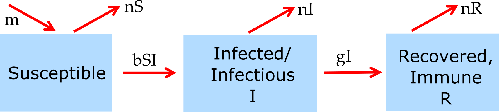

##Overview {#shinytab1}
This app lets you explore a _stochastic_ SIR model. Read about the model in the "Model" tab. Then do the tasks described in the "What to do" tab.

##The Model {#shinytab2}

###Model Overview

This model tracks susceptibles, infected/infectious and recovered hosts. 
The following compartments are included:  

* **S** - uninfected and susceptible individuals 
* **I** - individuals who are infected and infectious.
* **R** - recovered/removed individuals. Those individuals have recovered and are immune. 


The included processes/mechanisms are the following:

* Susceptible individuals (S) can become infected at rate _b_. 
* Infected hosts recover at rate _g_. 
* New susceptible hosts enter the system (are born) at rate _m_. Natural death occurs at rate _n_.


###Model Implementation
The flow diagram for the model implemented in this app is:


```{r BIdiagram,  fig.cap='Flow diagram for this model. ',  echo=FALSE}

```


Note that this model is _not_ an ordinary differential equation model. It is instead its stochastic equivalent.
We can specify the model by writing down every possible transition/event/reaction that can occur and their propensities (the propensity multiplied with the
time step gives the probability that a given event/transition occurs). For our model these are the following:

Event type              |  Transitions        |   Propensity      |
----------              |  -----------        |   ----------      |
Infection               |  S => S-1, I => I+1 |   bSI   |
Recovery                |  I => I-1, R => R+1 |   gI           |
Births                  |  S => S+1           |   m          |
Death of susceptible    |  S => S-1           |   nS          | 
Death of infected       |  I => I-1           |   nI          |
Death of recovered      |  R => R-1           |   nR          |


The differential equations - if we wanted to implement the model as an ODE - would look like this:

$$\dot S = m - bSI - nS$$
$$\dot I = bSI - gI - nI$$
$$\dot R = gI - nR$$

This is almost the same model as the basic SIR model from the introductory app, with the only difference that this model also allows natural births and deaths. In this app, you can run the basic SIR model together with the stochastic one and for m=n=0 you can compare the 2 models.

##What to do {#shinytab3}

**The tasks below are described in a way that assumes everything is in units of MONTHS (rate parameters, therefore, have units of inverse months). If any quantity is not given in those units, you need to convert it first (e.g. if it says a year, you need to convert it to 12 months).**

_Some of the simulations might take a few seconds to run. Be patient._

###Task 1: 


##Further Information {#shinytab4}
* This app (and all others) are structured such that the Shiny part (the graphical interface you are currently using and the server-side function that goes with it) calls an underlying R script which runs the simulation for the model of interest and returns the results.
* For this app, the underlying function running the stochastic simulation is called `simulate_stochastic_SIR.R`, the deterministic model is implemented in `simulate_introduction.R`. Check the help files for those functions to see how you can call them directly.
* To get a quick start explaining how to interact with the simulator functions directly, read the vignette for the package (type `vignette('DSAIDE')` into the R console).
* For some further reading concerning stochastic dynamics of ID, see e.g. [@lloyd-smith05a, @black66, @keeling97].

### References

