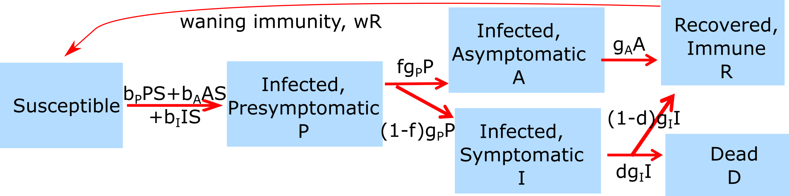

##Overview {#shinytab1}
In this app, we will explore a model that has several more compartments than the basic SIR model discussed in the _Introduction to ID_ app. Read about the model in the "Model" tab. Then do the tasks described in the "What to do" tab.

##The Model {#shinytab2}

###Model Overview
*Note: I'll be using the term **individual(s)** and **host(s)** interchangably in the future. This is common usage and I want you to get used to this terminology, therefore I'm switching around on purpose. They mean the same thing in this context.*

In the _Introduction to ID_ app, you explored a simple 3-compartment model, the basic SIR model. The model for this app has a few additional compartments, which allows us to include more details/realism into our model. We again focus on tracking individuals with regard to their infection/disease status. For this model, we track the following compartments/stages:

* **S** - susceptible, uninfected individuals 
* **P** - presymptomatic individuals who are infected and do not yet show symptoms. Those individuals can potentially be infectious.
* **A** - asymptomatic, infected individuals. Those individuals can potentially be infectious.
* **I** - individuals who are infected and show symptoms. Those individuals are likely infectious, but the model allows to adjust this, including no infectiousness.
* **R** - recovered/removed individuals. Those individuals have recovered and are immune. 
* **D** - individuals who have died due to the disease.

Of course, as with the basic SIR model, this model could be made to include further details by extendind the compartments. E.g. doubling the compartments would allow us to stratify according to gender. In general, for each additional distinct feature you want to track, the existing number of compartments needs to be replicated by the discrete categories you have. So replicated by 2 for gender, replicated by 3 if we wanted to stratify by young/medium/old age, etc. 

In addition to specifying the *compartments* of a model, we need to specify the dynamics determining the changes for each compartment. In general, more compartments leads to more processes and more parameters governing these processes.

For this model, we include the following processes: 

* Susceptible individuals (S) can become infected by pre-symptomatic (P), asymptomatic (A) or symptomatic (I) hosts. The rates at which infections from the different types of infected individuals (P, A and I) occur are governed by 3 parameters, $b_P$, $b_A$ and $b_I$. In other words, those $b_i$ parameters determine how infectious an individual in stages $P$, $A$ and $I$ is.
* All infected individuals first enter the presymptomatic stage. They remain there for some time (determined by rate $g_P$, the inverse of which is the average time spent in the presymptomatic stage). A fraction $f$ of presymptomatic hosts move into the asymptomatic category, the rest become symptomatic infected hosts.
* Asymptomatic infected hosts recover after some time (specified by the rate $g_A$). 
* Similarly, infected symptomatic hosts leave that stage at rate $g_I$. For symptomatic hosts, two outcomes are possible, either recovery or death. The parameter $d$ determines the fraction of hosts that die.
* Recovered individuals are immune to reinfection. 

###Model Implementation
The flow diagram and the set of ordinary differential equations (ODE) which are used to implement this model are as follows:

$$\dot S = -S (b_P P + b_A A + b_I I)  $$ 
$$\dot P = S (b_P P + b_A A + b_I I) - g_P P $$ 
$$\dot A = f g_P P - g_A A $$ 
$$\dot I = (1-f) g_P P - g_I I $$ 
$$\dot R = g_A A + (1-d) g_I I $$
$$\dot D = d g_I I $$

##What to do {#shinytab3}

_A general note: Some of the tasks below (and in future apps) are fairly open ended. In general, I don't want you to just do the tasks like a check-list. Instead, I want you to explore these simulations. Play with them, query them, go through iterations of thinking what you expect, observing it, and if discrepancies occur, figure out why. Essentially, I want you to "do science/research"._ 

###Task 1: 
* Set the model parameters such that it corresponds to the following setting: 
    * A population size of 1000, 1 initially infected, presymptomatic host, simulation duration 200 days.
    * Assume that only symptomatic individuals transmit, at rate $b_I = 0.001$.
    * Assume that the duration of the presymptomatic, asymptomatic and symptomatic periods are all 5 days long. (Hint: The parameters g~P~, g~A~ and g~I~ are the inverse of these periods.)
    * Assume that there are no asymptomatic infections and nobody dies due to disease.

* With parameters set to correspond to the scenario just described, run the simulation.
* Record the number and fraction of susceptible/infected/recovered remaining at the end of the outbreak.    
* Check the results with the assumptions for the model and make sure they agree (you shouldn't get any deaths, no asymptomatics, etc.)
* From the graph, contemplate how you would estimate the day at which the outbreak peaks. What's the problem? How would you solve it?
* Run the simulation again, with the same values you just had. Does anything change? Why (not)?

###Task 2: 
* Assume now that half of the infected are asymptomatic. Don't change any other assumption.
* What do you expect to get for the number/fraction of S/I/R at the end of the outbreak and the time at which the outbreak peaks?
* Run another simulation, record the same values as above.
* Compare your expectations with the results. How do they agree/disagree? Does it make sense? Anything surprising happening?

###Task 3: 
* Now assume that the asymptomatics transmit at the same rate as the symptomatics. Leave everything as in #2.
* How do you expect the results to change? (Try to make as precise/quantitative a prediction as you can)
* Run another simulation, record the same values as above.
* Compare your expectations with the results. How do they agree/disagree? Does it make sense? Anything surprising happening?

###Task 4: 
* Next, let's assume that half the symptomatic infected die. Leave everything as in #3.
* How do you expect the results to change?
* Run another simulation, record the same values as above.
* Compare your expectations with the results. How do they agree/disagree? Does it make sense? Anything surprising happening?

###Task 5: 
* Further explore how changes in the infectiousness of the different groups (b~P~, b~A~, b~I~) and the average time a person spends in each of those states (g~P~, g~A~, g~I~) affects the infection dynamics.
* Every time, think about what you expect to get, then run the simulation, compare your expectations with the results. Then make sense of it.

###Task 6: 
* Further explore how changes in the fraction becoming asymptomatic and fraction dying does (or does not) affect the infection dynamics.
* Every time, think about what you expect to get, then run the simulation, compare your expectations with the results. Then make sense of it.

###Task 7:
* Keep exploring.
* Think about real-world IDs and interventions. What groups would those interventions target, how would that affect the outcome?

##Answers 
##Answer 1: 

###Answer 2: 

###Answer 3: 

##Further Information {#shinytab4}

* For this app, the underlying function running the simulation is called `simulate_idcharacteristics.R`. You can call this function directly, without going through the shiny app. Check the help file for the function for more information. If you go that route, you need to use the results returned from this function and produce useful output (such as a plot) yourself. 
* You could also modify this R function for your own purposes - though that requires R coding knowledge.
* Some further information covering the concepts this app addresses can be found in [@kajita07, @milwid16].

###References

