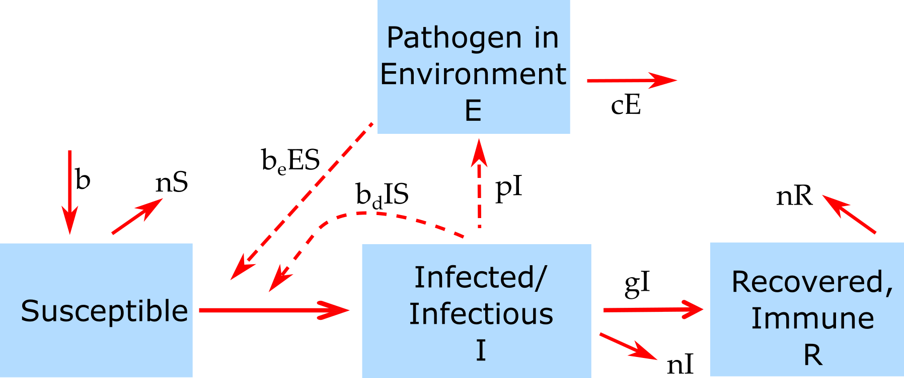

##Overview {#shinytab1}
This app allows you to explore a model which allows for both direct transmission and transmission through an environmental stage. Read about the model in the "Model" tab. Then do the tasks described in the "What to do" tab.

##The Model {#shinytab2}

###Model Overview

This is a simple SIR model with an additional environmental compartment.

This model has the following compartments:  

* **S** - uninfected and susceptible individuals 
* **I** - individuals who are infected and infectious.
* **R** - recovered/removed individuals.
* **E** - pathogen in the environment.

The processes being modeled are:

* Susceptible individuals can become infected by either direct contact with infected hosts at rate _b~d~_ or through contact with pathogen in the environment at rate _b~e~_.
* Infected hosts recover after some time (specified by the rate _g_). 
* New susceptibles enter (are born) at a rate _b_. From each compartment, hosts "leave" after some time (i.e. they die) at rate _n_. The inverse of this rate is the average lifespan of a host. 
* Infected hosts shed pathogen into the environment at rate _p_.
* Pathogen in the environment decays at rate _c_.

###Model Implementation
The flow diagram and the set of ordinary differential equations (ODE) which are used to implement this model are as follows:

$$\dot S =b - b_d S I - b_e S E - nS$$ 
$$\dot I = b_d S I + b_e S E - g I -nI$$ 
$$\dot R = g I - nR$$
$$\dot E = p I - cE$$

###A comment on terminology  
Often the letter _E_ is used for the _exposed_ stage, which would then be called an SEIR model. I'm using the letter _E_ here to denote environmental stage of the pathogen. While this could also be abbreviated to SEIR (or maybe SIRE), if you see the terminology _SEIR model_ somewhere, the authors usually refer to a model with the additional exposed stage, not environmental stage. There are no naming rules for either model compartments or parameters, so you will see all kinds of letters used. They should all be clearly specified by the authors such that there is no ambiguity.

##What to do {#shinytab3}

_A general note: Some of the tasks below are fairly open ended. You shouldn't go through the tasks like a check-list. Instead, explore these simulations, play with them, query them. As you do, loop through iterations of formulating your expectations for a specific scenario/task, running the model and observing results, and if results don't agree with your expectations, figure out why. Essentially, **"do science/research"**._ 

###Task 1: 
* Set the model parameters such that it corresponds to the following setting: 
    * A population size of 1000, 1 initially infected host, no pathogen in environment, simulation duration approximately 5 years.
    * We'll first look at direct transmission. Set transmission rate of _b~d~ = 0.001_, environmental transmission to 0.
    * Set environmental pathogen shedding and clearance to 0. 
    * Assume that the duration of the infectious period is about 2 months long. 
    * Turn off births and deaths for now.
* Run the simulation. You should get the usual direct transmission outbreak and SIR dynamics.
* Record the number and fraction of susceptible/infected/recovered remaining at the end of the outbreak.    

###Task 2: 
* Now try various values for the rate of shedding into the environment and environmental clearance. Leave everything else unchanged.
* As you change those parameters away from 0, what do you expect to see?
* Think about your expectations, run the simulation and compare your expectations with the results.
* Anything surprising happening? Do you understand why you are seeing what you see?

Note: The 'pathogen in the environment' units are arbitrary here, and parameters are chosen such that everything fits (mostly) into a single plot. To compare with real data, where environmental pathogen load might be very high, you would need to show separate plots, or plot on a log scale.

###Task 3: 
* Now set _p = 10_ and _c = 10_ . Turn off direct transmission. Run to make sure you don't get an outbreak.
* Turn on environmental transmission, set it to _b~e~ = 0.001_. What do you expect to see? 
* Run simulations and compare with the direct transmission results.

###Task 4: 
* Now also turn on direct transmission by setting _b~d~ = b~e~ = 0.001_. What do you expect to see?
* Run simulations and see how your expecations hold up.

###Task 5: 
* Now set initial number of infected to 0 and inital pathogen in the environment to 1. What do you expect to see?
* Run simulations and see how your expecations hold up.

###Task 6: 
* Try different combinations of direct and environmental transmission only and having only infected hosts or only pathogen in the environment at the start. What do you expect to see?
* Run simulations and see how your expecations hold up.

###Task 7: 
* Keep exploring by trying different parameters and transmission settings and see how they influence results.
* You can also turn on births/deaths and see what you get.
* As you continue your exploration, think about potential real infectious diseases that might be approximated by either one of the transmission types, and what settings for other model parameters would be for those ID.

##Answers 
This section does not have the shinytab label and is therefore ignored and not included in the app. One could provide the answers here. Note that if this file is supplied with the package, the answers are in principle available, so most users might not know where/how to look.

###Answer 1: 
Answer to task 1.

##Further Information {#shinytab4}

* For this app, the underlying function running the simulation is called `simulate_environmentaltransmission.R`. You can call this function directly, without going through the shiny app. Check the help file for the function for more information. If you go that route, you need to use the results returned from this function and produce useful output (such as a plot) yourself. 
* You could also modify this R function for your own purposes - though that requires R coding knowledge.
* Some more information on environmentally transmitted ID and modeling can be found in [@codeco01].

### References

