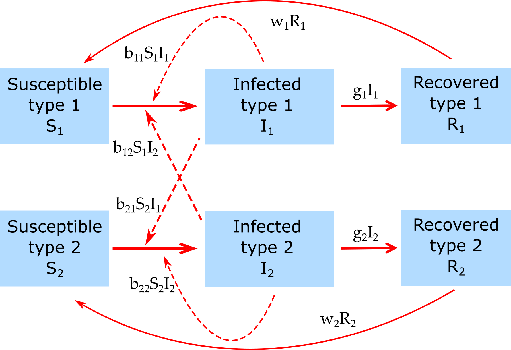

##Overview {#shinytab1}
For this module, we will explore a simple SIR model with 2 types of hosts. Read about the model in the "Model" tab. Then do the tasks described in the "What to do" tab.

##The Model {#shinytab2}

###Model Overview

This model tracks susceptibles, infected and recovered of 2 different types. Think of those types as e.g. males/females, children/adults, etc. 

The following compartments are included, twice for each type (i=1,2):  

* **S~i~** - uninfected and susceptible individuals 
* **I~i~** - individuals who are infected and infectious.
* **R~i~** - recovered/removed individuals. Those individuals have recovered and are immune. 

The included processes/mechanisms are the following:

* Susceptible individuals of type 1 or 2 can become infected by infected hosts of type 1 or 2. The rates at which infections from type 1/2 to type 1/2 occur are given by the parameters _b~11~_, _b~12~_, _b~21~_ and _b~22~_. 
* Infected hosts of type 1/2 recover after some time at rates _g~1~_/_g~2~_. 
* Recovered individuals are initially immune to reinfection. They can lose their immunity at rates _w~1~_/_w~2~_ and return to the susceptible state. 
 

###Model Implementation
The flow diagram and equations describe the model implemented in this app:

$$\dot S_1 = - S_1 (b_{11} I_1 + b_{12} I_2) + w_1 R_1 $$ 
$$\dot I_1 =  S_1 (b_{11} I_1 + b_{12} I_2) - g_1 I_1 $$ 
$$\dot R_1 = g_1 I_1 - w_1 R_1 $$
$$\dot S_2 = - S_2 (b_{22} I_2 + b_{21} I_1) + w_2 R_2 $$ 
$$\dot I_2 =  S_2 (b_{22} I_2 + b_{21} I_1) - g_2 I_2  $$ 
$$\dot R_2 = g_2 I_2 - w_2 R_2 $$

##What to do {#shinytab3}

**The tasks below are described in a way that assumes everything is in units of MONTHS (rate parameters, therefore, have units of inverse months). If any quantity is not given in those units, you need to convert it first (e.g. if it says a year, you need to convert it to 12 months).**

###Task 1: 
Set the model parameters such that it corresponds to the following setting: 

 * 1000 susceptible hosts and 1 infected host of type 1.
 * 200 susceptible hosts and 1 infected host of type 2. 
 * Simulation duration approximately 5 years.
 * Assume that transmission from host 1 to host 1 is _b~11~ = 0.002_, from host 2 to host 2 is _b~22~ = 0.01_. No transmission from one host type to the other _b~12~ = 0_ and _b~21~ = 0_.
 * Assume that the duration of the infectious period is 1 month long for both types ( _g~1~_ and _g~2~_ ). 
 * No waning immunity.
    
With parameters set to correspond to the scenario described, run the simulation and ensure you get outbreaks in both populations with 20% susceptibles left at the end.

###Task 2: 
* Set _b~11~ = 0.001_. Rest as before. Run the simulation.
* Now set the transmission rate from host 2 to host 1 _b~21~ = 0.001_. You should see an outbreak in both populations. This is an example of a core group driving the dynamics. Contemplate what the core group does.

###Task 3: 
* Keep all settings as before, but set initial number of infected type 1 hosts to 0.
* Contemplate what you expect to see, run the simulation, see if your expectations are confirmed.
* Now set the initial number of infected type 1 hosts back to 1, and infected type 2 hosts to 0. 
* Contemplate what you expect to see, run the simulation, see if your expectations are confirmed.

###Task 4: 
* Set the transmission rate from host 1 to host 1 and from host 2 to host 2 to 0. 
* Set the transmission rate from host 2 to host 1 to 0.01, from host 1 to host 2 to 0.002. Those are the same values used in task 1 for transmission among the same hosts.
* Set _I1~0~ = 1_ and _I2~0~ = 1_.
* Contemplate what you expect to see, run the simulation, see if your expectations are confirmed.
* Now set the transmission rate _b~12~ = 0.01_, and _b~21~ = 0.002_. Again, think about your expectations, run simulation and check.

###Task 5: 
* Repeat the previous task, with only an infected of type 1 initially present.
* Contemplate what you expect to see, run the simulation, see if your expectations are confirmed.

###Task 6: 
* Repeat the previous task, with only an infected of type 2 initially present.
* Contemplate what you expect to see, run the simulation, see if your expectations are confirmed.

###Task 7: 
* Set everything as in task 1, but with waning immunity _w~1~ = w~2~ = 0.2_ .
* Run simulation, confirm that both populations reach a steady endemic state.
* Set transmission rate _b~21~ = 0.005_, run the simulation and see what changes.
* Set transmission rate _b~12~ = 0.005_, and _b~21~ = 0_. Run the simulation and see what changes.

###Task 8: 
* With the settings you just had, turn off waning immunity for type 1, run the simulation and see what you get.
* Turn waning immunity for type 1 back on and turn off for type 2, run the simulation and see what you get.

###Task 9: 
* Keep exploring. Think of a real ID where accounting for 2 types of hosts is important, see if you can use the simulation to approximate and explore that ID.

  

##Further Information {#shinytab4}

* For this app, the underlying function running the simulation is called `simulate_heterogeneity.R`. You can call this function directly, without going through the shiny app. Check the help file for the function for more information. 
* If you call the function directly, you need to process the results returned from this function and produce useful output (such as a plot) yourself. 
* You can also modify this R function for your own purposes. To find out how to do that, type `?DSAIDE` at the R console.
* For some more information dealing with host heterogeneity, see e.g. [@beldomenico10, @yorke78, @lloyd-smith05].

### References
