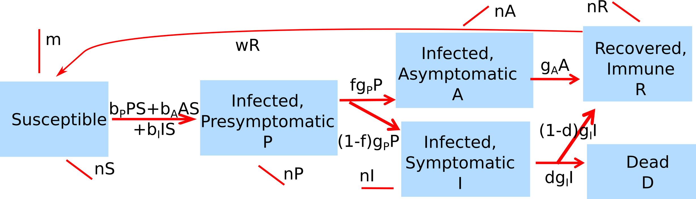

##Overview {#shinytab1}
This app allows you to explore a model that tracks the same compartments as the _Characteristics of ID_  model. If you haven't yet explored the _Characteristics of ID_ model, I suggest you try out that one first.
The model for this app adds a few more processes. It includes natural births and deaths of hosts, seasonal variation in transmission, and waning immunity.

Also note that for this model, the time units are in months, not days.
Read about the model in the "Model" tab. Then do the tasks described in the "What to do" tab.

##The Model {#shinytab2}

###Model Overview

This model has the same compartments as the one we saw previously. They are listed and described again:  

* **S** - uninfected and susceptible individuals 
* **P** - individuals who are infected and do not yet show symptoms. Those individuals can potentially be infectious
* **A** - individuals who are infected and do not show symptoms. Those individuals can potentially be infectious
* **I** - individuals who are infected and show symptoms. Those individuals are likely infectious, but the model allows to adjust this, including no infectiousness.
* **R** - recovered/removed individuals. Those individuals have recovered and are immune. They can loose their immunity in this model.
* **D** - individuals who have died due to the disease.

We include the following processes in this model:

* Susceptible individuals (S) can become infected by pre-symptomatic (P), asymptomatic (A) or symptomatic (I) hosts. The rates at which infections from the different types of infected individuals (P, A and I) occur are governed by 3 parameters, $b_P$, $b_A$ and $b_I$. 
* All infected individuals first enter the presymptomatic stage. They remain there for some time (determined by rate $g_P$, the inverse of which is the average time spent in the presymptomatic stage). A fraction _f_ of presymptomatic hosts move into the asymptomatic category, the rest become symptomatic infected hosts.
* Asymptomatic infected hosts recover after some time (specified by the rate _g~A~_). Similarly, the rate _g~I~_ determines the duration the symptomatic hosts stay in the symptomatic state. For symptomatic hosts, two outcomes are possible. Either recovery or death. The parameter $d$ determines the fraction of hosts that die.
* Recovered individuals are initially immune to reinfection. They can loose their immunity at rate $w$ and return back to the susceptible compartment. 
* New susceptibles enter the system/model at a fixed rate $\lambda$. From each compartment (apart from the dead compartment), hosts "leave" after some time (i.e. they die) at rate $n$. The inverse of this rate is the average lifespan of a host. 
* The rates of transmission, $b_P$, $b_A$ and $b_I$ can vary seasonally/annually, modeled as a sinusoidal function. The strength of this seasonal variation is controlled by the parameter $\sigma$.

Note that we only track people that die due to the disease in our $D$ compartment. All hosts dying due to other causes just "exit the system" and we don't further keep track of them (though we could add another compartment to "collect" and track all individuals who died from non disease related causes.)

###Model Implementation
The flow diagram and the mathematical model which are implemented in this app are as follows:

$$b_P^s = b_P(1+\sigma \sin(2\pi t /12))$$
$$b_A^s = b_A(1+\sigma \sin(2\pi t /12))$$
$$b_I^s = b_I(1+\sigma \sin(2\pi t /12))$$
$$\dot S = \lambda - S (b_P^s P + b_A^s A + b_I^s I) + wR - n S $$ 
$$\dot P = S (b_P^s P + b_A^s A + b_I^s I) - g_P P - n P$$ 
$$\dot A = f g_P P - g_A A - n A$$ 
$$\dot I = (1-f) g_P P - g_I I - n I $$ 
$$\dot R = g_A A + (1-d) g_I I - wR - n R$$
$$\dot D = d g_I I $$

Since we do not track people dying due to non-disease causes, all the "n - arrows" are not pointing to another compartment, instead those individuals just "leave the system". Similarly new susceptibles enter the system (are born) from "outside the system".

Also note that the transmission rates, _b~i~_, can be time varying as described above.

##What to do {#shinytab3}

_Note: Some of the simulations might take a few seconds to run. Be patient._

###Task 1: 
* Set the model parameters such that it corresponds to the following setting: 
    * A population size of 1000, 1 initially infected, presymptomatic host, simulation duration (approximately) 10 years.
    * Assume that only symptomatic individuals transmit, at rate $b_I = 0.002$, and that there is no seasonal variation.
    * Assume that the duration of the symptomatic period is 1 month long. (Hint: The parameter $g_i$ is the inverse of this period. Also, the model parameters are in units of 1/month.)
    * Assume that the duration of the presymptomatic period is approximately 6 days long. (Hint: The parameter $g_P$ is the inverse of this period. Also, the model parameters are in units of 1/month. Make sure you convert correctly.)
    * Assume that there are no asymptomatic infections. You can therefore set the rate of recovery of asymptomatics, $g_A$ to anything, it doesn't matter because nobody will be asymptomatic.
    * Assume nobody dies due to disease, and immunity does not wane.
    * Assume that there are no births and non-disease deaths occurring.

* With parameters set to correspond to the scenario just described, run the simulation and ensure you get a single outbreak.

###Task 2: 
* Next, turn on births and deaths. It's always good to check parts of a model. Here, we want to first look at births and deaths in the absence of disease. Therefore, set initial number of infected to 0, keep the initial population size at 1000. 
* Set the natural death rate, $n$, to a value that corresponds to an average lifespan of 41 years. Recall that the unit of $n$ is 1/months. You therefore need to convert lifespan to years, then take the inverse to get the death rate. Set the slider to a value as close as possible (you can't set it to exactly the value you get).
* Set the birth rate to $\lambda=4$ per month. 
* Also increase the simulation duration to 1000 years. (Depending on the speed of your computer, it will take several seconds for the simulation to finish).
* Apply what you learned in the reading about steady states to compute the expected steady state population size of susceptibles, i.e. solve $\dot S = 0 = \lambda - n S$ for the value of S given the values of $\lambda$ and $n$. Compare what you from the simulation. The 2 should agree, i.e. $S$ should reach the value you computed after some time.

###Task 3: 
* Try out different values for the initial population size, run the simulation and note what you get for the final, steady state population size. 
* Try out different values for the birth and death rate and note how that influences the final, steady state population size.
* Compare with the theory/math and your expectations.

###Task 4: 
* Next, set the birth and death rate as in task #2 and also adjust the population size to the steady state value you found in task #2. We do that because we don't want a mixing of underlying population growth/decline dynamics on top if the ID dynamics. That would make it more complicated to understand what's going on. (You get to do that later).
* Ensure that if you run the simulation now, nothing changes.
* Now introduce an infected individual, with other values as set in task #1. If needed, adjust the simulation duration to see the initial pattern and have everything reach the steady state.
* What do you expect to see? Run the simulation, compare expectations with results.

###Task 5: 
* From the reading, you know how to compute the steady state value of $S$ for the endemic scenario for an SIR model. Since individuals spend a very short time in $P$ compared to $I$, and nobody enters $A$ and $D$, we are approximately running an SIR model. Let the model run to the steady state, record the number of susceptibles at the end of the simulation (make sure you set the simulation time long enough for the system to settle into steady state). 
* Compare the value obtained from the simulation with that from the endemic steady state equation for $S$ found in the reading. They should (approximately) agree.
* You can also check it for $I$ and $R$. 

###Task 6: 
* The patterns we've seen so far are oscillations/cycles (i.e. repeated outbreaks) that eventually settle down to a steady state. The oscillations are what we referred to in the reading as _intrinsic_, purely produced by the interplay between depletion of susceptibles due to infection and replenishment due to birth.
* We discussed that waning immunity is another mechanism of resource replenishment. To investigate that, set everything as in task #1 (i.e. no more births and deaths). Do a quick run to ensure you get a single outbreak.
* Now, assume that immunity wanes within on average 10 months. 
* Think about your expectations, run the simulation and check with what you expected.
* Double the _duration_ of immunity. What do you expect? What do you see?

###Task 7: 
* Now combine births and deaths with waning immunity. Explore how the two different mechanisms interact and influence the observed ID dynamics.

###Task 8: 
* So far, the cycles were due to the intrinsic dynamics of the system. Now we'll explore what happens if some outside phenomenon - e.g. the weather - influences some model parameters. This is systematically different than before, where we kept all parameters constant while the simulation was running. Now we change that. Specifically the model allows you to let the transmission rates vary sinusoidal with a period of 1 year.
* Set everything as in task #1, do a quick run to make sure you only get one outbreak.
* Now try different non-zero values for the parameter sigma. Think about your expectations. Run the model and compare. Figure out why you are seeing what you see.

###Task 9: 
* Assume now that immunity wanes within 10 months. Also set the strength of seasonal variation (sigma) to 0.5. 
* Think about your expectations. Run the model and compare. Adjust the simulation time to "zoom in/out".
* Play around with sigma and the duration of immunity, see how different values affect the patterns you see.
* contemplate the main difference between the pattern you now observe and the ones you've seen so far with no external/seasonal driver.

###Task 10: 
* Go crazy! You can let people enter the $A$ and $D$ compartments, have an underlying growing or declining population in the absence of disease and let the disease run on top of it, allow for birth/death, waning immunity and seasonality, etc.
* There is lots to explore. While it can be fun to just mess around with the sliders and continue simulating, I suggest a more deliberate exploration. Before you run a simulation, think about what you expect. Then run and compare results with expectations. If they don't agree, try to figure out what's going on. This way, you will gain more and more insight into how the different components and processes influence the observed outcome - the basics of a systems science approach.

##Further Information {#shinytab4}

* For this app, the underlying function running the simulation is called `simulate_idpatterns.R`. You can call this function directly, without going through the shiny app. Check the help file for the function for more information. 
* If you call the function directly, you need to process the results returned from this function and produce useful output (such as a plot) yourself. 
* You could also modify this R function for your own purposes, though that requires experience writing R code. To find out how to do that, type `?DSAIDE` at the R console.
* For some papers discussing ID patterns and seasonality, see e.g. [@dowell01, @altizer06].

###References

