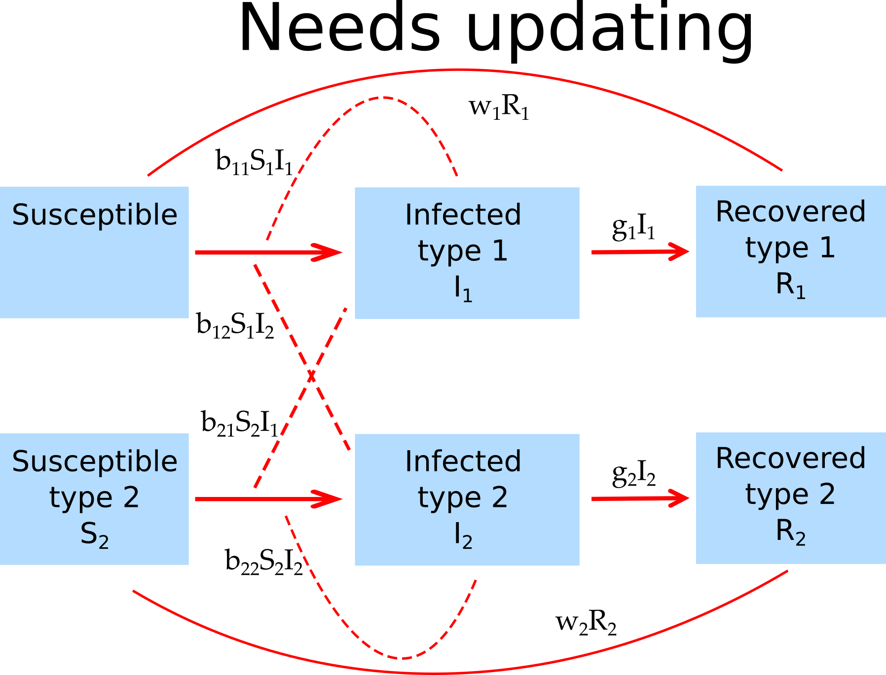

```{r}
################
#This R chunk only exists as an easy way to add comments - a bit trickier in Markdown itself
################
#You can adjust settings in the YAML header for styling 
#first make sure your simulator function is in the \R folder 
#and your App is in an appropriately named folder inside \shinyapps
#use this template and fill it with information for your App
#turn this into an HTML file using RMarkdown (knitr/pandoc)
#make sure the HTML file is in the directory with all the App documentation
#run the processing script (processAllFiles.R), which processes all documentation
#if everything works, the information described below should automatically be displayed in tabs at the bottom of the App UI
#note that the processing script changes some of the styling as specified in the shinystyle.css file
```

##Overview {#shinytab1}
This app allows you to explore a model with 2 pathogens. Read about the model in the "Model" tab. Then do the tasks described in the "What to do" tab.

##The Model {#shinytab2}

###Model Overview

This model tracks susceptible hosts, hosts infected with either pathogen 1, pathogen 2 or both, and individuals recovered from infection with pathogen 1, pathogen 2 or both. As usual, infected hosts are assumed to be infectious.

The following compartments are included:  

* **S** - uninfected and susceptible individuals.
* **I~1~** - individuals who are infected with pathogen 1.
* **I~2~** - individuals who are infected with pathogen 2.
* **I~12~** - individuals who are infected with both pathogen 1 and 2.
* **R~1~** - individuals recovered from infection with pathogen 1, still susceptible to pathogen 2.
* **R~2~** - individuals recovered from infection with pathogen 2, still susceptible to pathogen 1.
* **I~1X~** - individuals previously infected with pathogen 2 and now infected with pathogen 1.
* **I~2X~** - individuals previously infected with pathogen 1 and now infected with pathogen 2.
* **R~12~** - individuals recovered from infection with both pathogen 1 and 2.


The included processes/mechanisms are the following:

* Susceptible individuals can become infected with either pathogen 1 or 2.  
* Hosts infected with pathogen 1 or 2 can become infected with the other pathogen.
* Hosts infected with pathogen 1, 2 or both infect susceptibles or hosts infected with the other pathogen at rates _b~1~_/_b~2~_/_b~12~_. For simplicity, we assume that the rates are independent of the status of the host that becomes infected (e.g. an **S** host and a **I~1~** can become infected at the same rates with pathogen 2). It also does not matter if a host has previously recovered from an infection with the other pathogen.
* Hosts infected with both pathogens infect susceptibles with either pathogen 1 or 2 at fractions _a_/_(1-a)_. We do not consider the possibility that both pathogens are transmitted at the same time.
* Infected hosts recover after some time at rates _g~1~_/_g~2~_/_g~12~_. The rate of recovery does not depend on previous infections.
* Recovered individuals are immune to reinfection by the pathogen they have already been infected with (either at the same time or consecutively) but can still be infected with the pathogen they have not yet been infected with. 


###Model Implementation
The flow diagram and the set of differential equations for the mathematical model implemented in this app are as follows:



$$\dot S =  -  (b_{1} (I_1+I_{1X}) + b_{2} (I_2+I_{2X}) + b_{12}I_{12}) S  $$ 
$$\dot I_1 =   (b_{1} (I_1+I_{1X}) + ab_{12} I_{12})S - (g_1  + b_{2} (I_2+I_{2X})  + b_{12}  I_{12}) I_1$$ 
$$\dot I_2 =   (b_{2} (I_2+I_{2X}) +  (1-a) b_{12} I_{12})S - (g_2 + b_{1}(I_1 + I_{1X}) + b_{12} I_{12}) I_2$$ 
$$\dot I_{12} = (b_{2} (I_2+I_{2X})  + b_{12}  I_{12}) I_1 + (b_{1}(I_1 + I_{1X}) + b_{12} I_{12}) I_2  - g_{12} I_{12}$$ 
$$\dot R_1 = g_1 I_1 - (b_2 (I_2 + I_{2X}) + b_{12}  I_{12}) R_1$$
$$\dot R_2 = g_2 I_2 - (b_1 (I_1 + I_{1X}) + b_{12}  I_{12}) R_2$$
$$\dot I_{1X} = (b_1 (I_1 + I_{1X}) + b_{12}  I_{12}) R_2 - g_{1} I_{1X}$$
$$\dot I_{2X} = (b_2 (I_2 + I_{2X}) + b_{12}  I_{12}) R_1 - g_{2} I_{2X}$$
$$\dot R_{12} = g_{1} I_{1X} + g_{2} I_{2X} + g_{12} I_{12} $$


##What to do {#shinytab3}
_For the following tasks, it is assumed that the model runs in units of days._

###Task 1: 
* First, make sure each pathogen can produce an outbreak by itself.
* Set the initial number of infected with pathogen 1 to 1, all other infected at zero. Susceptibles at 1000.
* Set all transmission rates to 0.001, all recovery rates at 0.5.
* Set fraction of pathogen 1 infections to a=0.5.
* Run the simulation for 100 days, check that you only get a single outbreak with pathogen 1.
* Now set initial number of infected with pathogen 1 to 0, with pathogen 2 to 1. Run the simulation and check that you get exactly the same size outbreak with pathogen 2.

###Task 2: 
* Leave everything as before but now start with 1 infected for both pathogen 1 and 2. You should see outbreaks for both pathogens with the same dynamics (in fact, you won't see the curves for I1, R1, etc. since they are covered by the curves for I2, R2.)

###Task 3: 
* Now start with I10=1 and I20=10. What do you expect to see? What do you find?

###Task 4: 
* Go back to I10=I20=1, instead set b2=0.002. What do you expect to see? What do you find?
* What do you conclude has the stronger impact, higher initial number of infected for pathogen 2 or higher transmissibility?

###Task 5: 
* To confirm that things are completely "symmetric", re-do the 2 previous tasks but now instead of changing pathogen 2 initial infected or transmission rate, do it for pathogen 1.

###Task 5:
* Set everything back as in task #2, i.e. the 2 pathogens have the same starting numbers and transmission rates.
* Now play around with the fraction of pathogen 1 infections, a. What do you expect? What do you find?

###Task 6:
* Keep exploring. Investigate how some of the other parameters influence the outbreak dynamics for the 2 pathogens.
* Always follow the same pattern: Think about what you results you expect to get from a certain scenario/parameter setting and why. Then check with the simulation. If things don't agree, figure out why not. 


##Further Information {#shinytab4}

* This app (and all others) are structured such that the Shiny part (the graphical interface you are currently using and the server-side function that goes with it) calls an underlying R script which runs the simulation for the model of interest and returns the results.
* For this app, the underlying function running the simulation is called `simulate_multipathogen.R`. You can call this function directly, without going through the shiny app. Type `?simulate_multipathogen` into the R console for more information (you need to exit the graphical interface first or start a new R session). If you go that route, you need to use the results returned from this function and produce useful output (such as a plot) yourself. 
* You can also modify this R function for your own purposes. That requires some more R coding knowledge. 
* To get a quick start explaining how to interact with the simulator functions directly, read the vignette for the package (type `vignette('DSAIDE')` into the R console).


### References

