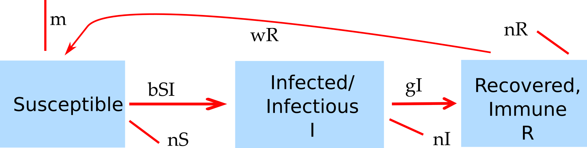

##Overview {#shinytab1}
This app lets you explore the concept of the reproductive number. Read about the model in the "Model" tab. Then do the tasks described in the "What to do" tab.

##The Model {#shinytab2}

###Model Overview
For this app, we'll use the basic compartmental SIR model. We allow for 3 different stages/compartments: 

* **S** - uninfected and susceptible individuals 
* **I** - infected and infectious individuals (note that these terms are often used interchangeably, but technically we are talking about someone who is infected **and** is infectious, i.e. can infect others)
* **R** - recovered/removed individuals. Those are individuals that do not further participate, either because they are now immune or because they died.

In addition to specifying the *compartments* of a model, we need to specify the dynamics determining the changes for each compartment. Broadly speaking, some processes increase the number of individuals in a given compartment/stage and other processes that lead to a reduction. Those processes are sometimes called inflows and outflows. 

For our system, we specify the following processes/flows: 

* Susceptible individuals (S) can become infected by infectious individuals (I) at some rate, _b_. This leads to the susceptible individual leaving the S compartment and entering the I compartment.   
* Infected individuals recover and enter the recovered (R) compartment at some rate, _g_.
* Recovered individuals can lose immunity at rate _w_ and return to the susceptible compartment. 
* Natural births (into the S compartment at rate _m_) and deaths (from all compartments at rate _n_) are possible.
* The model allows a fraction of individuals to be vaccinated before the outbreak. Those individuals are moved into the R compartment before the start of the outbreak.

###Model Implementation
The flow diagram and the set of equations which are used to implement this model are as follows:

$$S_{v} = (1-ef)S_0$$
$$R_0 = efS_{v}$$
$$\dot S =m - b SI - nS + wR$$ 
$$\dot I = \ S I - g I - nI$$
$$\dot R = g I - nR - wR$$

Here, S~0~ is the initial population of susceptibles, and S~v~ is the susceptible population after vaccination. Vaccinated individuals are moved to the R compartment before the start of the outbreak.

##What to do {#shinytab3}

_The following tasks ask you to use various equations to compute the reproductive number. If you are not familiar with those, you need to do some background reading, e.g. the books listed in the ID introduction app or some of the papers listed in the _Further Resources_ section of this app._

**The tasks below are described in a way that assumes everything is in units of MONTHS (rate parameters, therefore, have units of inverse months). If any quantity is not given in those units, you need to convert it first (e.g. if it says a year, you need to convert it to 12 months).**

###Task 1: 
* Set the simulation with a total population size of 1000, 999 susceptibles and 1 infected.
* Simulation time 60 months, _g_=5, _b_=0.01. Everything else at 0.
* Run the simulation, you should get an outbreak.
* Use the final size equation linking R~0~ and the fraction of susceptible hosts left at the end of the outbreak to compute the reproductive number. 

###Task 2: 
* Use the equation that expresses R~0~ as a function of model parameters for the simple SIR model. Using the values of the model parameters, compute R~0~ that way. Check that it agrees with what you found in task #1.

###Task 3: 
* Double the value of the transmission parameter, _b_. Before you run the simulation, what do you expect to see and what do you expect to get for R~0~?
* Run the simulation and compute R~0~ using the final outbreak size to test your expectations. 

###Task 4: 
* Now, double the rate of the recovery parameter, _g_. Think about your expectations for R~0~ and the dynamics.
* Run the simulation to check your expectations. Use the final outbreak size to compute R~0~.

###Task 5: 
* Set the model parameters back to those given in task #1.
* Another way to estimate R~0~ is to determine the rate of increase in infected hosts at the beginning of the outbreak. During the initial phase, new infections increase exponentially according to _I(t)=I~0~ exp(rt)_, with _r_ being the rate of growth. Usually, for any real outbreak, you do not know the number of infected at the start, I~0~, or the exact time the outbreak starts. It is still possible to estimate _r_ by obtaining two values of _I_ at two time points during that initial growth rate, i.e. _I~1~_ at time _t~1~_ and _I~2~_ at time _t~2~_. With those quantities, one can compute the exponential growth rate, _r_. Figure out how to determine those values and use them to compute _r_. Hint: play with the maximum simulation duration such that the simulation stops at 2 different times during the initial exponential growth phase.
* For this model, the growth rate and R~0~ are related through _R~0~ = 1+rD_, where _D_ is the average duration of the infectious period (i.e. the inverse of the recovery rate). Use this to determine R~0~. You should get essentially the same answer (up to some rounding differences) as for task #1.
* Note that the choice of _t~1~_ and _t~2~_ can influence the results. Earlier times are better since once the number of susceptibles starts to drop markedly, the growth of infected slows down and is not exponential anymore.

###Task 6: 
* What is the value of R at the time the outbreak peaks? (It's only called R~0~ at the beginning for a fully susceptible population). Explain how you can find that value for R, both using intuitive reasoning and using the equation for R~0~ given above (R~0~ = 1+rD). Note that at this R value, the outbreak wanes, but people still get infected. What R value would you need to halt any further infections completely?

###Task 7: 
* What would happen if a new ID came along that had an R~0~ value that was the same as the one you just determined in the previous question, namely the value of R at the peak of an outbreak? Test this with the simulation. Choose parameter values for which you get the right R~0~ and observe what the model produces.

###Task 8: 
* R~0~ quantifies the level of transmissibility of an ID, which determines how many people will become infected or what level of intervention is needed to stop/prevent an outbreak. However, it is important to be aware that R~0~ says nothing about the timing/dynamics of the outbreak. Set parameter values as in #1. Run an outbreak, record the time of peak and duration of the outbreak (the latter is somewhat ill-defined, so just come up with a rough number). Then increase the infectious duration by a factor of 4 (rate reduced by a factor of 4) and adjust the infectiousness-level such that you get the same R~0~ as before. Run again and compare the results concerning total outbreak size and timing of outbreak.    

###Task 9: 
* One usually obtains R~0~ from the data/literature and uses it to pick values for the transmission parameter. Let's try that. Go online and find (approximate) values for the duration of the infectious period and R~0~ for SARS. Keep the population size at 1000. Use those values to compute the transmission parameter, _b_. Run an outbreak, see if things work out right. Specifically, using the equation involving the final number of susceptibles left should give you an R~0~ that roughly agrees with the one you started out with.

###Task 10: 
* Knowing R is important for control strategies, e.g. for vaccine campaigns. You learned at what value of R an outbreak switches from growth to decline (often called the threshold value) and that for this R value, outbreaks don't take off. Let's say you have an ID that enters a new population where everyone is susceptible. That ID has R~0~=4. Would you expect to see an outbreak? Why? Now let's assume that we protected half the population through a (100% effective) vaccine. What is the new value for R, i.e. how many people are being infected on average by an infected person after we vaccinated? Is that new value of R low enough to prevent the outbreak? How low does R need to be to prevent an outbreak? What fraction of the population would you need to protect/vaccinate to achieve such an R? 

###Task 11: 
* Let's test the vaccination idea with the computer simulation. Set model parameters such that you get an R~0~=4. 
* Run the simulation for 0% vaccination coverage to confirm things happen as you expect. Check if the final size of the susceptible/infected population is what it should be and returns (approximately) an R~0~=4 when you use the final size equation to compute it. 
* Now repeat for 50% vaccination coverage at 100% vaccine efficacy. What is the value of the effective _R_ after vaccination? Run a simulation and check to make sure that is what you get. 
* Finally, run the simulation at the vaccination level you determined above to be enough to prevent an outbreak. Make sure your expectations and simulation results agree.

###Task 12: 
* Most vaccines are not perfect. What fraction of the population would you need to vaccinate for the scenario above if the vaccine efficacy/effectiveness was 75%? What if it was 60%? Confirm with the simulations.

###Task 13: 
* So far, we looked at an individual outbreak. Now we introduce births and deaths. For our model, we use a constant birth rate _m_ and a fixed per-capita death rate _n_.  It is possible to have population dynamics (births, deaths) in the absence of an ID. It is useful first to figure out what's going on there before you introduce the disease dynamics. 
* Choose various values for the birthrate and lifespan, run the model and see what the population does in the absence of an infectious disease. Can you figure out the equation that relates births, deaths and steady state level for our model? Test it with the simulation.

###Task 14: 
* If births (and deaths) are present, you will be able to get multiple outbreaks and endemic states. Set the parameter values such that your hosts have approximately an average lifespan of 41 years. Make sure to convert to months and convert to a rate. Set birth rate such that the population is steady at 1000 in the absence of the ID. Set simulation time to around 500 years, 1 infected, _g_=5, _b_=0.015. No vaccine. (Be patient, running the simulation takes some time.)
* Run the simulation, make sure you reach a steady state. Compare the steady state values for S, I and R from the simulation with those predicted from the SIR steady state equations.

###Task 15: 
* Use the fraction of susceptibles remaining at steady state to compute R~0~. 
* Double the value of _g_, run the simulation and again compute R~0~ using the steady state result. 
* Next double the values for both natural birth and death rates and repeat. 

###Task 16:
* Keep exploring. 

##Further Information {#shinytab4}
* This app (and all others) are structured such that the Shiny part (the graphical interface you are currently using and the server-side function that goes with it) calls an underlying R script which runs the simulation for the model of interest and returns the results.
* For this app, the underlying function running the simulation is called `simulate_reproductivenumber.R`. You can call this function directly, without going through the shiny app. Type `?simulate_reproductivenumber` into the R console for more information (you need to exit the graphical interface first or start a new R session). If you go that route, you need to use the results returned from this function and produce useful output (such as a plot) yourself. 
* You could also modify this R function for your own purposes - though that requires some more R coding knowledge. 
* To get a quick start explaining how to interact with the simulator functions directly, read the vignette for the package (type `vignette('DSAIDE')` into the R console).
* For some information on the reproductive number, see e.g. [@fine11, @heffernan05a, @roberts07, @wallinga07].

### References

