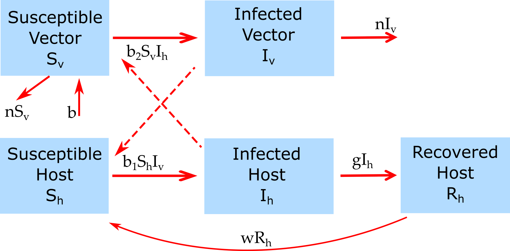

##Overview {#shinytab1}
This app allows you to explore a simple model for vector-borne transmission. Read about the model in the "Model" tab. Then do the tasks described in the "What to do" tab.

##The Model {#shinytab2}

###Model Overview

This is a simple 2 species (hosts and vectors) model, using the basic SIR framework as follows.

The model has the following compartments:  

* **Sh** - uninfected and susceptible host 
* **Ih** - infected/infectious hosts
* **Rh** - recovered/removed hosts
* **Sv** - susceptible vectors
* **Iv** - infected/infectious vectors

We assume that once a vector is infected, it stays infected until it dies. Therefore, recovered vectors are not included in the model.

The processes being modeled are:

* Susceptible host can become infected by contact with infected vectors at rate _b~1~_ 
* Susceptible vectors can become infected by contact with infected hosts at rate _b~2~_ 
* Infected hosts recover after some time (specified by the rate _g_). 
* New susceptible vectors are born at a rate _b_. Susceptible and infected vectors die at rate _n_. The inverse of this rate is the average lifespan. 
* Recovered hosts lose their immunity at rate _w_.

We envision hosts to be humans and vectors to be e.g. mosquitos. We further assume the time scale for the model is short enough that we can ignore births and deaths for human hosts but not vectors. This is likely a decent approximation as long as our simulation time is not more than few years.

###Model Implementation
The flow diagram and the set of ordinary differential equations (ODE) which are used to implement this model are as follows:

$$\dot S_h = - b_1 S_h I_v + w R_h$$ 
$$\dot I_h = b_1 S_h I_v  - g I_h$$ 
$$\dot R_h = g I_h - w R_h$$
$$\dot S_v =b - b_2 S_v I_h - n S_v$$ 
$$\dot I_v = b_2 S_v I_h  - n I_v$$ 

##What to do {#shinytab3}

_A general note: Some of the tasks below are fairly open-ended. You shouldn't go through the tasks like a check-list. Instead, explore these simulations, play with them, query them. As you do, loop through iterations of formulating your expectations for a specific scenario/task, running the model and observing results, and if results don't agree with your expectations, figure out why. Essentially, **"do science/research"**._ 

**The tasks below are described in a way that assumes everything is in units of MONTHS (rate parameters, therefore, have units of inverse months). If any quantity is not given in those units, you need to convert it first (e.g. if it says a year, you need to convert it to 12 months).**

###Task 1: 
* Set the model parameters such that it corresponds to the following setting: 
    * A population size of 1000 for both hosts and vectors, 1 initially infected host, no infected vector, simulation duration approximately 10 years.
    * Set host -> vector transmission rate, _b~2~_=0.001. Keep _b~1~_ = 0.
    * Assume that the duration of the infectious period in hosts is half a month (about 2 weeks) long. 
    * Turn off births and deaths and waning immunity for now.
* Run the simulation, observe what you get. 
* Now set _b~1~_ = _b~2~_, rerun. Then set _b~1~_ = 2 _b~2~_, run again.
* Record the number and fraction of susceptible/infected/recovered remaining at the end of the outbreak.    

###Task 2: 
* Now start with no infected hosts and 1 infected vector. What do you expect to see? Run the simulation to check your expectation.
* Play around with a different initial number of infected hosts and vectors and different transmission rates.
* Anything surprising happening? Do you understand why you see what you see?

###Task 3: 
* Turn off any infection process by setting the number of initial infected hosts and vectors to 0. 
* Let's assume our vectors are mosquitos, and that they live for about 1 month. Set the death rate accordingly.
* Set the birth rate such that the vector population settles at 2000.

###Task 4: 
* Turn infection process back on by having an infected host. Everything else as above.
* Contemplate the dynamics you see. 
* You have births and deaths now, and usually with those, you can get multiple outbreaks. Why not here?

###Task 5: 
* Assume host immunity wanes after an average of 4 months. 
* What do you expect to see? Run simulations to check your expectations.

###Task 6: 
* Keep exploring. 
* Try to figure out how the different parameters influence the dynamics, specifically the (lack of) sustained cycles.

##Answers 
This section does not have the shinytab label and is therefore ignored and not included in the app. One could provide the answers here. Note that if this file is supplied with the package, the answers are in principle available.

###Answer 1: 
Answer to task 1.

##Further Information {#shinytab4}

* For this app, the underlying function running the simulation is called `simulate_vectortransmission.R`. You can call this function directly, without going through the shiny app. Check the help file for the function for more information. If you go that route, you need to use the results returned from this function and produce useful output (such as a plot) yourself. 
* You could also modify this R function for your own purposes.
* To learn more about the underlying simulations and how to access and use the code, see the package vignette, which you can open by typing `vignette('DSAIDE')` in the R console.
* Some more information on vector-borne diseases and modeling can be found in [@kilpatrick12, @luz10].

###References

